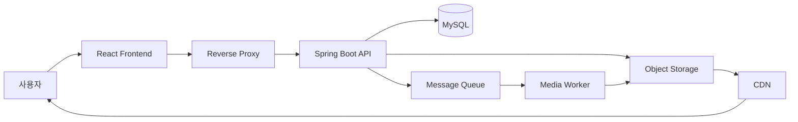
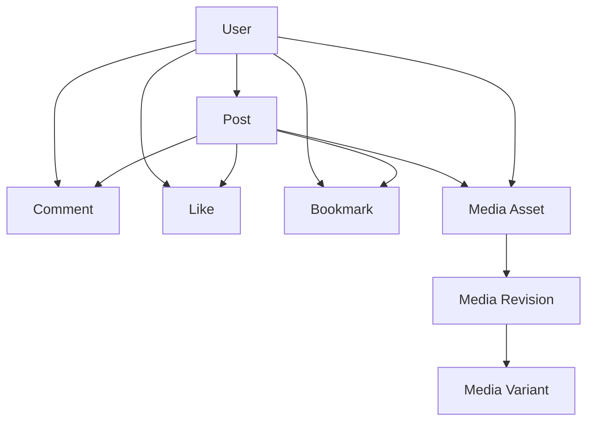
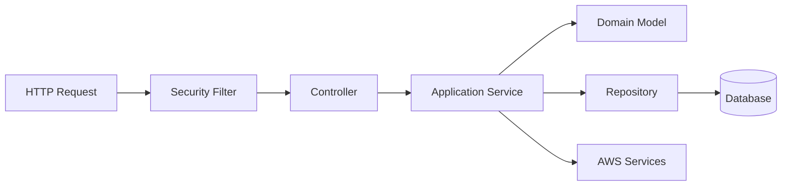
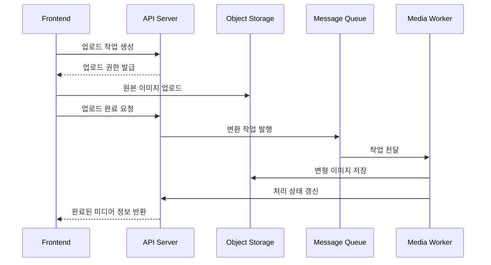

# PULSE Backend

> 콘텐츠와 사용자 반응을 안전하게 저장하고,  
> 인증과 미디어 처리의 전체 수명주기를 관리합니다.

[](https://github.com/BS-Stack-Lab/KTB4-ian-community-BE/actions/workflows/ci.yml)

[Frontend Repository](https://github.com/BS-Stack-Lab/KTB4-ian-community-FE)
· Service Demo
· API Documentation

## 프로젝트 소개

PULSE Backend는 회원과 인증, 게시글과 댓글, 좋아요와 북마크, 이미지 처리
기능을 제공하는 Spring Boot 기반 커뮤니티 API입니다.

단순한 CRUD 서버를 넘어 실제 운영 환경에서 필요한 인증 보안, 데이터
일관성, 비동기 미디어 처리, 마이그레이션과 배포 안정성을 함께 고려했습니다.

## 프로젝트 정보

| 항목 | 내용 |
| --- | --- |
| 개발 기간 | YYYY.MM.DD ~ YYYY.MM.DD |
| 개발 인원 | Frontend N명, Backend N명 |
| 담당 범위 | API, 인증, 데이터 모델, 테스트, 인프라, 배포 |
| 운영 환경 | Docker, MySQL, AWS, Nginx |

## Backend 책임

| 도메인 | 주요 책임 |
| --- | --- |
| 인증 | 로그인, 로그아웃, Token 발급과 갱신 |
| 사용자 | 회원가입, 프로필, 비밀번호, 계정 상태 |
| 게시글 | 작성, 조회, 수정, 삭제와 페이지네이션 |
| 상호작용 | 댓글, 좋아요, 북마크, 조회 상태 |
| 미디어 | 업로드, 이미지 변환, Revision과 Variant |
| 운영 | 상태 확인, 마이그레이션, 모니터링과 배포 |

## 시스템 구성



### API Server

인증과 권한 검증, 커뮤니티 데이터 변경, 미디어 작업 생성을 담당합니다.

### Database

회원과 게시글, 댓글, 좋아요, 북마크, 인증 세션과 미디어 상태를 저장합니다.
운영 환경에서는 애플리케이션 시작 시 데이터베이스 스키마가 현재 코드와
호환되는지 검증합니다.

### Media Worker

Queue에서 이미지 작업을 가져와 실제 변환을 수행합니다. 성공한 결과만
활성화하고 반복적으로 실패한 작업은 격리할 수 있습니다.

### Object Storage and CDN

원본 이미지와 공개 이미지를 구분해 관리합니다. 클라이언트는 공개가 허용된
변형 이미지에 CDN을 통해 접근합니다.

## 도메인 관계



### User

사용자 이메일과 닉네임의 중복을 방지하고, 비밀번호는 단방향 암호화를
적용합니다. 삭제된 계정의 인증과 데이터 접근도 제한합니다.

### Post

작성자와 콘텐츠, 이미지, 생성·수정 상태를 관리합니다. 목록 조회에는
페이지네이션을 적용하고 사용자별 좋아요와 북마크 여부를 함께 제공합니다.

### Comment

게시글과 작성자를 기준으로 관리하며, 수정과 삭제 시 인증 사용자와 실제
작성자가 일치하는지 확인합니다.

### Media

원본 이미지, 편집 Revision, 용도별 Variant와 처리 상태를 관리합니다.
게시글과 프로필은 처리가 완료된 미디어만 참조할 수 있습니다.

## 서버 설계



| 계층 | 역할 |
| --- | --- |
| Security | 인증, CSRF, 예외 응답과 접근 권한 |
| Controller | 요청 검증과 응답 변환 |
| Service | 유스케이스와 트랜잭션 관리 |
| Domain | 데이터와 비즈니스 규칙 |
| Repository | 영속성 처리 |
| Integration | 저장소, Queue, CDN 등 외부 서비스 연동 |

## 핵심 구현

### JWT Cookie 인증

Access Token과 Refresh Token을 Cookie로 전달합니다.

JavaScript가 인증 Token을 직접 읽지 못하도록 제한하고, 데이터 변경
요청에는 CSRF 검증을 함께 적용합니다.

### Refresh Token Rotation

Refresh Token을 사용할 때마다 새로운 Token으로 교체합니다.

Token 계열과 사용 상태를 서버에서 관리해 이미 사용한 Token이 다시
요청되는 경우 해당 인증 계열을 폐기합니다.

이를 통해 다음 상황에 대응합니다.

- Refresh Token 탈취와 재사용
- 동시에 발생한 갱신 요청
- 로그아웃 이후 기존 Token 사용
- 삭제된 사용자의 Token 사용
- 서로 다른 사용자 사이의 Token 불일치

### 사용자 소유권 검증

요청에 포함된 사용자 식별자를 권한 판단의 기준으로 사용하지 않습니다.

인증 Token에서 확인한 실제 사용자를 기준으로 게시글, 댓글, 프로필 작업의
권한을 판단해 다른 사용자의 데이터를 변경하는 요청을 차단합니다.

### CSRF 보호

Cookie 기반 인증에서 발생할 수 있는 CSRF 공격을 방어합니다.

Frontend가 발급받은 CSRF Token을 요청 Header와 Cookie에 함께 전달하도록
하고, 서버에서 두 값을 검증합니다.

### 비동기 미디어 파이프라인



원본 업로드와 이미지 변환을 일반 API 요청에서 분리해 응답 지연과 서버
메모리 사용을 줄였습니다.

### Immutable Revision

이미지를 편집할 때 기존 결과를 덮어쓰지 않고 새로운 Revision을 생성합니다.

Worker 처리가 성공한 경우에만 새 Revision을 활성화하므로 실패한 편집
결과가 사용자에게 노출되지 않습니다.

### 미디어 재시도와 격리

Worker는 일시적인 장애와 영구적인 실패를 구분합니다.

일시적인 실패는 제한된 횟수만큼 재시도하고, 반복 실패한 작업은 별도 Queue로
이동시켜 정상 작업을 방해하지 않도록 합니다.

### 데이터베이스 마이그레이션

데이터베이스 변경은 버전이 지정된 마이그레이션으로 관리합니다.

로컬 개발과 운영 데이터베이스의 차이를 고려해 각각의 실행 환경에 맞는
스키마를 제공하고, 운영에서는 자동 생성 대신 검증을 우선합니다.

## 기술 스택

| 분류 | 기술 | 사용 목적 |
| --- | --- | --- |
| Language | Java 21 | 애플리케이션 구현 |
| Framework | Spring Boot 4 | REST API와 애플리케이션 구성 |
| Security | Spring Security 7, JWT, CSRF | 인증과 접근 제어 |
| Persistence | Spring Data JPA, Hibernate | 도메인 영속성 |
| Database | H2, MySQL | 로컬 개발과 운영 데이터 저장 |
| Migration | Flyway | 스키마 버전 관리 |
| Storage | Amazon S3 | 원본 및 변형 이미지 저장 |
| Queue | Amazon SQS | 비동기 이미지 작업 |
| Delivery | Amazon CloudFront | 공개 이미지 전달 |
| Monitoring | Actuator, CloudWatch | 상태 확인과 운영 지표 |
| Image | ImageMagick | 이미지 변환 |
| Test | JUnit, Testcontainers, LocalStack | 단위·통합·E2E 테스트 |
| Build | Gradle | 테스트와 패키징 |
| Deployment | Docker, Nginx, GitHub Actions | 빌드 및 배포 자동화 |

## 주요 트러블슈팅

| 문제 | 해결 | 결과 |
| --- | --- | --- |
| Refresh Token이 동시에 여러 번 사용됨 | Token 계열과 회전 상태를 트랜잭션으로 관리 | 중복 발급과 재사용 공격 차단 |
| 이미지 처리 시간이 API 응답을 지연함 | 업로드와 변환을 객체 저장소·Queue·Worker로 분리 | API 부하와 응답 시간 감소 |
| 편집 중 실패한 이미지가 활성화될 수 있음 | 완료된 Revision만 활성화하도록 상태 전이 제한 | 미완성 이미지 노출 방지 |
| 운영 스키마와 애플리케이션이 달라질 수 있음 | 마이그레이션 버전과 시작 시 검증 적용 | 배포 단계에서 불일치 조기 발견 |
| Worker가 같은 실패 작업을 반복함 | 재시도 횟수와 격리 Queue 적용 | 정상 작업 처리 방해 방지 |
| 운영 권한이 API와 Worker에 과도하게 부여됨 | 역할별 접근 권한 분리 | 침해 발생 시 영향 범위 축소 |

## 테스트 전략

### Unit Test

- 사용자와 게시글 비즈니스 규칙
- 이미지 Variant 정책
- 미디어 Revision 상태 전이
- 예외와 오류 응답
- JWT 생성과 검증

### Integration Test

- 회원가입과 로그인
- Token 발급·회전·재사용
- 게시글과 댓글 권한
- 좋아요와 북마크
- 데이터베이스 마이그레이션
- CSRF와 보안 설정
- 동시 요청 처리

### Media E2E

실제 운영 구조와 유사하게 다음 요소를 컨테이너로 구성합니다.

- MySQL
- Object Storage
- Message Queue
- API Server
- Media Worker

이를 통해 업로드부터 이미지 변환, 상태 갱신까지 전체 미디어 흐름을
검증합니다.

## 시작하기

### 요구 사항

- Java 21
- Docker 선택 사항
- 미디어 E2E 실행 시 Docker 필수

### JWT Secret 생성

```bash
openssl rand -base64 32
```

```bash
export JWT_SECRET="<생성한 Base64 값>"
export APP_FRONTEND_ORIGIN="http://127.0.0.1:4173"
```

### 애플리케이션 실행

```bash
./gradlew bootRun
```

기본 개발 환경에서는 별도의 데이터베이스나 AWS 리소스 없이 실행할 수
있으며, 미디어 V2 기능은 기본적으로 비활성화됩니다.

## 주요 명령어

| 명령어 | 설명 |
| --- | --- |
| `./gradlew test` | 단위·통합 테스트 |
| `./gradlew bootJar` | 실행 가능한 애플리케이션 빌드 |
| `./gradlew clean test bootJar` | 전체 기본 검증 |
| `./gradlew mediaE2e` | 미디어 파이프라인 E2E |

## 보안

- 비밀번호 단방향 암호화
- HttpOnly 인증 Cookie
- CSRF 검증
- 짧은 Access Token 수명
- Refresh Token 회전
- Token 재사용 감지
- 사용자 소유권 검증
- 운영 오류 상세 정보 비공개
- Non-root 컨테이너 실행
- 역할별 AWS 권한 분리
- 비밀값의 애플리케이션 이미지 저장 금지

## 운영과 배포

운영 환경은 API, Media Worker, Database, Reverse Proxy로 구성합니다.

- Commit과 컨테이너 이미지의 연관 관계 기록
- 변경되지 않는 이미지 Digest 기반 배포
- 배포 전 필수 검증 Gate
- 데이터베이스 백업과 복구
- 실패한 배포의 Rollback
- 상태 확인 기반 서비스 검증
- AWS 인프라 변경 사항 사전 검토
- 미디어 처리 지표와 실패 Queue 모니터링

상세한 인프라, 배포, 백업·복구와 마이그레이션 절차는 별도의 운영 문서로
관리합니다.

## 관련 저장소

- [PULSE Frontend](https://github.com/BS-Stack-Lab/KTB4-ian-community-FE)

## 팀

| 이름 | 역할 | 주요 담당 |
| --- | --- | --- |
| 이름 | Frontend | UI, 상태 관리, API 연동, 테스트 |
| 이름 | Backend | API, 인증, 데이터, 인프라 |
