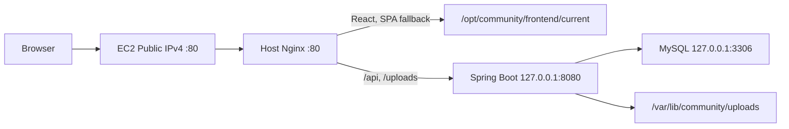

# EC2 한 대에 React와 Spring을 직접 배포하기: A 방식 회고

- 작성일: 2026-08-05
- 서비스: PULSE Community
- 배포 방식: EC2 직접 설치 + Host Nginx Reverse Proxy
- 검증 주소: `http://<검증 당시 EC2 Public IPv4>/`
- Domain·HTTPS: A 방식에서는 사용하지 않았습니다.

> 이 문서는 A 방식만 독립적으로 설명합니다. Docker Compose, Dynu, HTTPS는
> A 방식 검증 범위에 포함하지 않습니다.

## 1. 이번 작업에서 제 역할은 선택 기준을 정하는 일이었습니다

이번 배포 작업의 코드와 Script 작성, 오류 로그 분석은 대부분 AI에게
맡겼습니다. AI는 가능한 인프라 구성을 제안하고 반복 가능한 명령을
작성했습니다. 저는 그 선택지가 PULSE의 현재 규모와 이후 기능 추가에 적합한지
검토하고 AWS Console과 EC2에서 실제 명령을 실행했습니다.

비용만 고려하면 AI가 제안한 `t3.micro`도 선택할 수 있었습니다. 하지만
Spring Boot JVM, MySQL, Nginx와 운영체제를 함께 실행하면 1GiB 메모리는 기능이
많지 않은 현재 상태에서도 여유가 작아질 수 있습니다. 기능을 추가하면서
메모리가 부족해지는 상황을 줄이기 위해 2GiB 메모리를 제공하는 `t3.small`을
선택했습니다.

이번 과제는 A 방식과 B 방식을 모두 구현하도록 요구합니다. A 방식에서는 먼저
Docker 없이 운영체제 위에 Java, MySQL, Nginx를 직접 설치하면서 서비스가 어떤
Process와 Port, 파일 권한에 의존하는지 확인했습니다.

## 2. A 방식의 범위와 EC2 환경입니다

### 2.1 검증 범위입니다

| 항목      | A 방식에서 사용한 값                       |
| --------- | ------------------------------------------ |
| 접속 주소 | `http://<검증 당시 EC2 Public IPv4>/`      |
| 외부 Port | HTTP 80                                    |
| Domain    | 사용하지 않았습니다.                       |
| HTTPS     | 설정하지 않았습니다.                       |
| Backend   | Host Spring Boot, `127.0.0.1:8080`         |
| Database  | Host MySQL, `127.0.0.1:3306`               |
| Frontend  | Host Nginx가 React 정적 파일을 제공합니다. |

A 방식 검증 당시 Public IPv4는 `3.39.194.216`이었습니다. Elastic IP를 사용하지
않았으므로 EC2를 Stop/Start하면 이 주소는 달라질 수 있습니다. 따라서 이 IP는
현재 제출 주소가 아니라 A 방식의 검증 이력으로만 기록합니다.

### 2.2 실제 EC2 환경입니다

| 구분              | 실제 값                                     |
| ----------------- | ------------------------------------------- |
| AWS Region        | Asia Pacific (Seoul), `ap-northeast-2`      |
| AMI/OS            | Ubuntu Server 24.04 LTS                     |
| Architecture      | `x86_64`                                    |
| Instance type     | `t3.small`                                  |
| Root volume       | gp3 20GiB, 암호화, 종료 시 삭제             |
| 접속 방식         | AWS Systems Manager Session Manager         |
| IAM Role          | `community-ec2-ssm-role`                    |
| Instance Metadata | IMDSv2 Required, Hop limit 1                |
| Runtime           | OpenJDK 21.0.11, Nginx 1.24.0, MySQL 8.0.46 |
| 외부 차단 Port    | 22, 443, 8080, 3306                         |

SSH 22는 Artifact를 전송할 때만 제 Public IP `/32`에 임시로 허용하고 전송 직후
삭제했습니다. 이후 운영 작업은 Session Manager에서 진행했습니다.

EC2에 접속한 직후에는 다음 명령으로 Architecture, Disk, Memory와 기존
Listener를 확인했습니다.

```bash
# 실행 위치: EC2 Session Manager
uname -a
uname -m
df -h /
free -h
sudo ss -lntup
```

## 3. A 방식의 구조입니다



외부에는 Nginx의 80번 Port만 공개합니다. Spring Boot와 MySQL은 Loopback에서만
요청을 받습니다. 브라우저는 Backend의 8080번 Port를 직접 알 필요가 없습니다.

Frontend는 운영 환경에서 `/api`, `/uploads` 같은 same-origin 경로를
사용합니다. Host Nginx는 API 요청을 Spring Boot로 전달하고 나머지 요청은
React 정적 파일로 처리합니다.

```nginx
root /opt/community/frontend/current;
index index.html;

location /api/ {
    proxy_pass http://127.0.0.1:8080;
    proxy_set_header Host $host;
    proxy_set_header X-Real-IP $remote_addr;
    proxy_set_header X-Forwarded-For $proxy_add_x_forwarded_for;
    proxy_set_header X-Forwarded-Proto $scheme;
}

location /uploads/ {
    proxy_pass http://127.0.0.1:8080;
    proxy_set_header Host $host;
    proxy_set_header X-Forwarded-Proto $scheme;
}

location / {
    try_files $uri $uri/ /index.html;
}
```

`try_files`의 마지막 경로를 `index.html`로 지정해 `/feed`, `/posts/1` 같은
React Router 주소를 새로고침해도 화면이 열리도록 구성했습니다.

## 4. 운영 환경 변수와 Secret을 분리합니다

운영 환경 변수는 `/etc/community/backend.env`에 저장합니다. 실제 파일은
`root:community 640` 권한을 사용하고, 검증 Script에서도 값 자체를 출력하지
않습니다.

```dotenv
SPRING_PROFILES_ACTIVE=aws
DB_URL=jdbc:mysql://127.0.0.1:3306/community?useUnicode=true&characterEncoding=utf8&serverTimezone=Asia/Seoul
DB_USERNAME=community_app
DB_PASSWORD=<secret>
JWT_SECRET=<base64-secret-decoding-to-at-least-32-bytes>
FRONTEND_ORIGIN=http://<ec2-public-ip>
COOKIE_SECURE=false
DB_POOL_MAX_SIZE=10
DB_POOL_MIN_IDLE=2
```

`COOKIE_SECURE=false`는 HTTPS를 적용하지 않은 A 방식 HTTP 검증에서만 사용한
값입니다. DB 비밀번호와 JWT Secret 원문은 코드, Git, 문서와 명령 인자에
기록하지 않습니다.

Spring Boot의 AWS Profile은 Flyway가 Schema 변경을 담당하고 Hibernate는
현재 Schema가 Entity와 일치하는지만 검사하도록 구성했습니다.

```yaml
server:
  address: ${SERVER_ADDRESS:127.0.0.1}
  port: 8080
  shutdown: graceful

spring:
  datasource:
    url: ${DB_URL}
    username: ${DB_USERNAME}
    password: ${DB_PASSWORD}
  jpa:
    hibernate:
      ddl-auto: validate
  flyway:
    enabled: true
    clean-disabled: true
  h2:
    console:
      enabled: false
```

운영 환경에서 `ddl-auto=create`나 `update`를 사용하지 않으므로 애플리케이션
시작과 Schema 변경을 분리할 수 있습니다. H2 Console도 AWS Profile에서는
비활성화합니다.

## 5. 로컬 Mac에서 Artifact를 준비합니다

Backend 저장소의 Mac Terminal에서 Test와 JAR Build를 실행하고 배포 Bundle을
만들었습니다.

```bash
# 실행 위치: 로컬 Mac Terminal의 Backend 저장소
./gradlew clean test bootJar

mkdir -p /tmp/community-artifacts
cp build/libs/community-0.0.1-SNAPSHOT.jar \
  /tmp/community-artifacts/community-backend.jar

tar -czf /tmp/community-method-a.tar.gz \
  -C deployment method-a
```

Frontend 저장소에서는 Test와 Production Build를 실행하고 Nginx가 제공할 정적
파일을 Archive로 만들었습니다.

```bash
# 실행 위치: 로컬 Mac Terminal의 Frontend 저장소
npm run format:check
npm run test:unit
npm run test:integration
npm run build:react

tar -czf /tmp/community-artifacts/community-frontend.tar.gz \
  index.html dist
```

Security Group에서 SSH 22를 현재 Public IP `/32`에만 임시로 허용한 후 다음
명령으로 Artifact를 전송했습니다.

```bash
# 실행 위치: 로컬 Mac Terminal
ssh -i <private-key-path> \
  ubuntu@<ec2-public-ip> 'mkdir -p /tmp/community-artifacts'

scp -i <private-key-path> \
  /tmp/community-method-a.tar.gz \
  ubuntu@<ec2-public-ip>:/tmp/

scp -i <private-key-path> -r \
  /tmp/community-artifacts \
  ubuntu@<ec2-public-ip>:/tmp/
```

전송이 끝난 직후 22번 Inbound 규칙을 삭제했습니다. 실제 Private Key 경로는
문서와 Git에 기록하지 않습니다.

## 6. EC2에서 직접 설치하고 배포합니다

Session Manager에서 임시 디렉터리를 만든 후 Bundle을 압축 해제했습니다.
`mktemp` 결과를 변수에 보관하므로 생성된 임시 경로를 직접 다시 입력할 필요가
없습니다.

```bash
# 실행 위치: EC2 Session Manager
deployment_tmp="$(mktemp -d /tmp/community-method-a.XXXXXX)"
sudo tar -xzf /tmp/community-method-a.tar.gz \
  -C "${deployment_tmp}"
cd "${deployment_tmp}/method-a"

sudo scripts/01-install-packages.sh
sudo scripts/02-configure-user-and-directories.sh
sudo scripts/03-configure-mysql.sh
sudo scripts/install-operations.sh

cd /opt/community/deployment/method-a
sudo scripts/configure-backend-env.sh
sudo scripts/deploy.sh
sudo scripts/verify.sh
```

각 Script의 역할은 다음과 같습니다.

| Script                                 | 역할                                                            |
| -------------------------------------- | --------------------------------------------------------------- |
| `01-install-packages.sh`               | Java, MySQL, Nginx 등 OS Package를 설치합니다.                  |
| `02-configure-user-and-directories.sh` | 전용 사용자와 배포·업로드 경로를 만듭니다.                      |
| `03-configure-mysql.sh`                | MySQL을 Loopback에 묶고 Application 계정을 준비합니다.          |
| `install-operations.sh`                | 재부팅 후에도 사용할 운영 Bundle을 `/opt`에 설치합니다.         |
| `configure-backend-env.sh`             | Secret을 숨김 입력으로 받아 권한이 제한된 환경 파일을 만듭니다. |
| `deploy.sh`                            | JAR·Frontend Release, systemd와 Nginx 설정을 적용합니다.        |
| `verify.sh`                            | Service, Listener, 권한, H2 차단과 HTTP 응답을 확인합니다.      |

`community-backend.service`는 Spring Boot를 root가 아닌 `community` 사용자로
실행합니다.

```ini
[Service]
User=community
Group=community
EnvironmentFile=/etc/community/backend.env
ExecStart=/usr/bin/java -Xms256m -Xmx640m \
  -jar /opt/community/backend/app.jar
Restart=on-failure
UMask=0027

NoNewPrivileges=true
PrivateTmp=true
PrivateDevices=true
ProtectHome=true
ProtectSystem=strict
CapabilityBoundingSet=
ReadWritePaths=/var/lib/community/uploads
```

Filesystem 대부분은 읽기 전용으로 보호하고 Upload 디렉터리만 쓰기 경로로
허용합니다.

## 7. A 방식에서 실패한 작업과 해결 과정입니다

### 7.1 EC2에 없는 Archive를 바로 풀려고 했습니다

처음에는 Session Manager에서 `/tmp/community-method-a.tar.gz`를 바로
압축 해제했습니다. 하지만 해당 파일은 로컬 Mac에서 생성한 후 EC2로 전송해야
하는 Artifact였기 때문에 다음 오류가 발생했습니다.

```text
tar: /tmp/community-method-a.tar.gz: Cannot open: No such file or directory
```

해결 방법은 작업을 다음 세 단계로 분리하는 것이었습니다.

1. Mac에서 JAR, Frontend Archive와 운영 Bundle을 생성합니다.
2. SSH 22를 현재 IP `/32`에만 잠시 허용하고 `/tmp`로 전송합니다.
3. Session Manager에서 파일 존재와 Checksum을 확인한 후 설치합니다.

이후부터는 압축 해제 전에 다음 명령으로 파일을 확인했습니다.

```bash
# 실행 위치: EC2 Session Manager
ls -lh /tmp/community-method-a.tar.gz
sha256sum /tmp/community-method-a.tar.gz
```

### 7.2 Package 설치만으로 배포가 끝난다고 생각했습니다

초기 `verify.sh` 실행에서는 다음 항목이 실패했습니다.

```text
FAIL: mysql is not active
FAIL: community-backend is not active
FAIL: nginx is not active
```

`01-install-packages.sh`는 Package만 설치합니다. 사용자·디렉터리·DB·환경
파일·JAR·정적 파일·systemd를 준비하지 않으므로 `01`부터 `03`, 운영 Bundle
설치, 환경 파일 생성과 실제 배포를 순서대로 실행해야 합니다.

### 7.3 Shell Prompt까지 함께 붙여 넣었습니다

화면에 표시된 `$` Prompt를 명령과 함께 복사하고 줄바꿈이 사라지면서
`verify.shsudo`처럼 명령 두 개가 합쳐진 적이 있었습니다. `$`는 입력하지 않고
다음처럼 한 줄씩 실행한 후 각 결과를 확인하도록 변경했습니다.

```bash
# 실행 위치: EC2 Session Manager
cd /opt/community/deployment/method-a
sudo scripts/deploy.sh
sudo scripts/verify.sh
```

## 8. Release와 Rollback을 파일 덮어쓰기와 분리합니다

Backend와 Frontend는 기존 파일을 덮어쓰지 않고 Timestamp가 포함된 Release로
설치합니다.

```text
/opt/community/backend/releases/community-<UTC>.jar
/opt/community/backend/app.jar -> 선택된 JAR

/opt/community/frontend/releases/<UTC>/
/opt/community/frontend/current -> 선택된 정적 Release
```

현재 Release는 symlink로 가리킵니다. Rollback할 때는 Backend와 Frontend
symlink를 함께 전환해 화면과 API 계약이 서로 다른 버전을 가리키지 않게
합니다. DB와 Upload Backup은 Archive와 SHA-256을 한 세트로 만들고 Restore
명령에는 명시적인 확인 Token을 요구합니다.

## 9. A 방식의 완료 기준입니다

`verify.sh`와 외부 HTTP 검증에서 다음 항목을 확인했습니다.

| 검증 항목                   | 결과                 |
| --------------------------- | -------------------- |
| EC2 Public IPv4의 HTTP 화면 | 200                  |
| MySQL·Spring Boot·Nginx     | active               |
| Spring Boot 8080            | Loopback only        |
| MySQL 3306                  | Loopback only        |
| H2 Console                  | 운영 환경에서 비공개 |
| 환경 파일                   | `root:community 640` |
| Upload 경로                 | world-writable 아님  |
| 22·443·8080·3306 외부 접근  | 차단                 |
| 재부팅 후 DB·Upload         | 유지                 |
| Backup·Restore              | 성공                 |
| Release Rollback·복귀       | 성공                 |

A 방식은 EC2 Public IPv4의 HTTP 80에서 위 검증을 완료했습니다. 이 단계에는
Dynu, TLS 인증서, 443번 Port와 Secure Cookie를 포함하지 않았습니다.

## 10. A 방식을 수행하며 배운 점입니다

A 방식에서는 설치된 Package보다 실행 순서와 현재 Host 상태가 더 중요했습니다.
Nginx 문법이 정상이어도 Port를 다른 Process가 점유하면 Service는 시작하지
못합니다. Spring Boot Process가 active여도 8080이 외부에 Bind되어 있으면
보안 기준을 충족하지 못합니다.

직접 설치를 진행하면서 systemd, 파일 소유권, Loopback Listener, Migration
권한과 Release symlink도 애플리케이션 운영의 일부라는 점을 확인했습니다. 이
기준은 이후 B 방식에서 Dockerfile과 Compose 설정으로 옮기는 기준이 됩니다.

상세 검증 결과는 [A 방식 검증 보고서](./method-a/docs/VALIDATION_REPORT.md)에
기록했습니다. 외부 자료에서 참고한 지점은
[출처별 참고 문서](./DEPLOYMENT_TECH_BLOG_SOURCES.md)에 분리했습니다.
