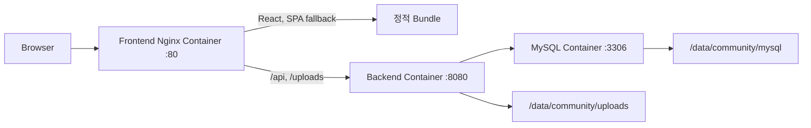

# Docker Compose로 React와 Spring을 통합 배포하기: B 방식 회고

- 작성일: 2026-08-05
- 서비스: PULSE Community
- 배포 방식: React·Spring 멀티스테이지 Image + Docker Compose + Nginx
- Compose 격리 검증 주소: `http://127.0.0.1:18088`
- B 작업 단계에서 추가한 Host 주소: <https://pulse.gleeze.com/>

> 이 문서는 B 방식만 독립적으로 설명합니다. Dynu와 HTTPS는 A 방식이 아니라
> B 방식 작업을 진행하면서 처음 적용했습니다. B Container의 격리 검증이 끝난
> 뒤에는 Container를 중지했으며, 최종 공개 주소는 Host Nginx가 제공합니다.

## 1. A 방식에서 확인한 운영 조건을 Container로 옮깁니다

이번 과제는 EC2 직접 설치 방식과 Docker Compose 방식을 모두 구현하도록
요구합니다. A 방식에서는 Java, MySQL, Nginx와 Spring Boot를 Host에 직접
설치했습니다. B 방식에서는 같은 서비스를 멀티스테이지 Docker Image와
Compose 선언으로 다시 구성했습니다.

A 방식에서 B 방식으로 넘어갈 때 AI와 제가 바라보는 완료 상태가 달랐습니다.
저는 한 EC2에서 A를 완료한 다음 B로 전환하면서 두 결과를 모두 증명하는
과정으로 이해했습니다. AI는 A와 B를 독립적으로 실행하고 검증할 수 있는 두
배포 산출물로 이해했습니다.

이 차이를 초기에 발견하지 못해 A의 Host Nginx와 B의 Frontend Container가
모두 80번 Port를 사용하려는 문제가 실제 실행 단계에서 발생했습니다. 이후
“두 방식을 모두 구현한다”와 “두 방식을 동시에 공개한다”를 구분했습니다. B
방식은 `127.0.0.1:18088`에서 격리 검증하고, 최종 공개 상태에서는 B Container를
중지해 Port 충돌을 제거했습니다.

## 2. B 방식에서 편리해진 점입니다

B 방식을 적용한 이유 자체는 과제 요구사항이지만, A 방식과 비교하면서 다음
장점을 확인할 수 있었습니다.

- Host의 Java와 Node 버전을 개별적으로 맞추는 대신 Dockerfile의 Builder
  Image로 빌드 환경을 고정합니다.
- `docker compose up --wait` 한 번으로 MySQL, Backend, Frontend의 Health를
  순서대로 확인하며 실행합니다.
- Backend와 MySQL Port를 Host에 공개하지 않고 Compose Network 안에서만
  연결합니다.
- 같은 commit-tagged Image와 Release 환경 파일로 실행 환경을 다시 만들 수
  있습니다.
- `current.env`와 `previous.env`를 이용해 현재 Release와 Rollback 대상을
  구분합니다.
- `docker compose logs`, `docker compose ps`, `docker stats`로 서비스별 상태와
  자원 사용량을 같은 방식으로 확인합니다.

| 작업 항목       | A 방식                                 | B 방식                                               |
| --------------- | -------------------------------------- | ---------------------------------------------------- |
| 배포 단위       | JAR과 정적 Archive                     | commit-tagged Docker Image                           |
| 실행 순서       | 운영 Script 순서에 의존합니다.         | `service_healthy` 조건으로 선언합니다.               |
| Process 관리    | systemd Service를 각각 관리합니다.     | Compose가 세 Service를 함께 관리합니다.              |
| Backend·DB 연결 | `127.0.0.1`을 사용합니다.              | Compose DNS인 `backend`, `mysql`을 사용합니다.       |
| Secret          | Host 환경 파일을 사용합니다.           | Host Secret 파일을 필요한 Container에만 Mount합니다. |
| Rollback        | Backend·Frontend symlink를 전환합니다. | 이전 Image와 Release env를 전환합니다.               |

B 방식이 모든 면에서 단순한 것은 아닙니다. Image Platform, Container User,
read-only Filesystem, Volume과 Network까지 새로 확인해야 합니다. 하지만 여러
Host 설정으로 나뉘었던 실행 조건을 Dockerfile과 `compose.yaml`에서 함께 볼 수
있다는 점이 편리했습니다.

## 3. B 방식의 실행 환경과 구조입니다

### 3.1 EC2 환경입니다

| 구분                 | 실제 값                                  |
| -------------------- | ---------------------------------------- |
| AWS Region           | Asia Pacific (Seoul), `ap-northeast-2`   |
| AMI/OS               | Ubuntu Server 24.04 LTS                  |
| Architecture         | `x86_64`                                 |
| Instance type        | `t3.small`                               |
| Root volume          | gp3 20GiB, 암호화, 종료 시 삭제          |
| 접속 방식            | AWS Systems Manager Session Manager      |
| Docker 대상 Platform | `linux/amd64`                            |
| Compose Service      | MySQL, Backend, Frontend                 |
| 공개 Service         | Frontend Nginx만 Host Port에 연결합니다. |
| 비공개 Service       | Backend와 MySQL은 `expose`만 사용합니다. |

B 방식의 세 Container는 한 시점에 약 866.7MiB의 메모리를 사용했습니다. 이
수치는 Apple Silicon의 amd64 에뮬레이션 환경에서 측정한 Snapshot이므로 EC2의
성능 수치로 일반화하지 않습니다. 다만 운영체제와 Docker Daemon의 사용량까지
고려하면 1GiB의 `t3.micro`보다 2GiB의 `t3.small`이 안전하다고 판단하는 근거로
활용했습니다.

### 3.2 Compose 구조입니다



Compose Network 안에서는 Service 이름을 DNS처럼 사용합니다. Frontend
Nginx는 `backend:8080`으로 API 요청을 전달하고 Backend는 `mysql:3306`으로
연결합니다. Backend와 MySQL은 Host Port를 Publish하지 않습니다.

B Container의 전체 검증에서는 Host Nginx와의 충돌을 피하기 위해 Frontend를
다음 값으로 실행했습니다.

```dotenv
HTTP_BIND_ADDRESS=127.0.0.1
HTTP_PORT=18088
FRONTEND_ORIGIN=http://127.0.0.1:18088
COOKIE_SECURE=false
```

## 4. Spring Boot를 멀티스테이지 Image로 만듭니다

Backend [`Dockerfile`](../Dockerfile)은 JDK Builder에서 Test와 Boot JAR
생성을 실행하고 Runtime에는 JRE와 결과 JAR만 남깁니다.

```dockerfile
FROM ${JDK_IMAGE} AS builder
WORKDIR /workspace
COPY gradlew build.gradle settings.gradle ./
COPY gradle ./gradle
COPY src ./src
RUN --mount=type=cache,target=/root/.gradle \
    ./gradlew --no-daemon clean test bootJar

FROM ${JRE_IMAGE} AS runtime
RUN groupadd --gid 10001 community \
    && useradd --uid 10001 --gid community \
       --home-dir /nonexistent --no-create-home \
       --shell /usr/sbin/nologin community

COPY --from=builder --chown=community:community \
    /workspace/build/libs/community.jar /app/community.jar

USER community:community
ENTRYPOINT ["java", "-jar", "/app/community.jar"]
```

JDK는 Build Stage에서만 사용합니다. Runtime Image는 JRE와 애플리케이션 JAR만
포함하며 UID/GID `10001`의 non-root 사용자로 실행합니다. Base Image는 Tag와
Digest를 함께 고정해 같은 Commit을 다시 빌드할 때 기반 Image가 임의로
바뀌는 범위를 줄였습니다.

## 5. React를 멀티스테이지 Image로 만듭니다

Frontend Dockerfile은 Node Builder에서 Webpack Build를 실행하고 Nginx
Runtime에는 정적 파일만 복사합니다.

```dockerfile
FROM node:24.14.0-alpine3.23 AS builder
WORKDIR /app
COPY package.json package-lock.json ./
RUN npm ci --no-audit --no-fund
COPY index.html webpack.config.js ./
COPY src ./src
RUN npm run build:react \
    && find dist -type f -name '*.map' -delete

FROM nginx:1.28.2-alpine3.23 AS runtime
COPY docker/nginx.conf /etc/nginx/nginx.conf
COPY --from=builder --chown=nginx:nginx \
    /app/index.html /usr/share/nginx/html/index.html
COPY --from=builder --chown=nginx:nginx \
    /app/dist /usr/share/nginx/html/dist
USER nginx
```

Runtime Container에는 Node.js와 Source Map을 남기지 않습니다. Frontend Build
Argument에도 DB, JWT와 AWS Secret을 전달하지 않습니다.

Container Nginx는 정적 파일과 API Reverse Proxy를 함께 처리합니다.

```nginx
location /dist/ {
    try_files $uri =404;
    expires 1y;
    add_header Cache-Control "public, max-age=31536000, immutable" always;
}

location /api/ {
    proxy_pass http://backend:8080;
    proxy_set_header X-Forwarded-For $proxy_add_x_forwarded_for;
    proxy_set_header X-Forwarded-Proto $scheme;
}

location / {
    try_files $uri $uri/ /index.html;
    add_header Cache-Control "no-store, no-cache, must-revalidate" always;
}
```

Hash가 없는 `index.html`은 캐시하지 않고, Hash가 포함된 정적 Bundle에는
immutable Cache를 적용합니다. Nginx가 read-only root filesystem에서도
동작하도록 임시 파일 경로는 `/tmp`로 구성합니다.

## 6. Compose에 의존성과 격리 조건을 선언합니다

핵심 실행 조건은 [`compose.yaml`](./ec2-compose/compose.yaml)에 선언합니다.

```yaml
services:
  mysql:
    image: ${MYSQL_IMAGE}
    expose: ["3306"]
    volumes:
      - ${DATA_ROOT}/mysql:/var/lib/mysql
    healthcheck:
      test: ["CMD", "mysqladmin", "ping", "--host=127.0.0.1", "--silent"]

  backend:
    image: ${BACKEND_IMAGE}
    user: "10001:10001"
    expose: ["8080"]
    read_only: true
    depends_on:
      mysql:
        condition: service_healthy
    volumes:
      - ${DATA_ROOT}/uploads:/var/lib/community/uploads

  frontend:
    image: ${FRONTEND_IMAGE}
    ports:
      - "${HTTP_BIND_ADDRESS}:${HTTP_PORT}:80"
    read_only: true
    depends_on:
      backend:
        condition: service_healthy
```

MySQL이 healthy가 된 후 Backend를 시작하고 Backend가 healthy가 된 후
Frontend를 시작합니다. Application Container에는 `privileged=false`,
`no-new-privileges`, `cap_drop: ALL`, PID·CPU·Memory Limit을 적용합니다.

MySQL과 Upload 데이터는 Container Layer가 아니라 Host 경로에 저장합니다.

```text
/data/community/mysql
/data/community/uploads
/data/community/backup
/data/community/releases
```

따라서 Container를 재생성해도 DB와 Upload 파일이 유지됩니다.

## 7. 환경 변수와 Secret을 분리합니다

Image Tag와 공개 가능한 Release 설정은 `.env`에 저장합니다.

```dotenv
FRONTEND_IMAGE=community-frontend:<commit-sha>
BACKEND_IMAGE=community-backend:<commit-sha>
MYSQL_IMAGE=mysql:8.4.7
MYSQL_DATABASE=community
DB_USERNAME=community

DATA_ROOT=/data/community
SECRETS_DIR=/etc/community/secrets
HTTP_BIND_ADDRESS=127.0.0.1
HTTP_PORT=18088

FRONTEND_ORIGIN=http://127.0.0.1:18088
COOKIE_SECURE=false
DB_POOL_MAX_SIZE=8
DB_POOL_MIN_IDLE=1
JAVA_TOOL_OPTIONS=-Xms256m -Xmx640m -XX:+ExitOnOutOfMemoryError
```

실제 Secret은 다음 파일에 분리합니다.

```text
/etc/community/secrets/mysql-root-password
/etc/community/secrets/mysql-app-password
/etc/community/secrets/jwt-secret
```

Secret 파일은 `root:community-secrets 0640`으로 보호합니다. Compose는 필요한
Container에만 파일을 Mount하고 Backend는 Config Tree로 값을 읽습니다.

```yaml
environment:
  SPRING_CONFIG_IMPORT: optional:configtree:/run/secrets/
secrets:
  - source: mysql_app_password
    target: DB_PASSWORD
  - source: jwt_secret
    target: JWT_SECRET
```

실제 DB 비밀번호와 JWT Secret은 `.env`, Compose 명령, 문서와 Git에 기록하지
않습니다.

## 8. 로컬 Mac에서 Image를 Build하고 검증합니다

Frontend 저장소의 Mac Terminal에서 EC2 대상 `linux/amd64` Image를 Build하고
단독 Container 검증을 실행했습니다.

```bash
# 실행 위치: 로컬 Mac Terminal의 Frontend 저장소
./scripts/build-image.sh

IMAGE_TAG=community-frontend:<frontend-commit-sha> \
  ./scripts/verify-image.sh
```

`build-image.sh`는 Git Commit을 기반으로 Image Tag를 만들고 멀티스테이지
Dockerfile을 Build합니다. `verify-image.sh`는 non-root User, Runtime Node.js
부재, SPA Fallback, `/api` Proxy와 Nginx 문법을 검사합니다.

Backend 저장소에서는 Backend Image를 만들고 Frontend, Backend, MySQL Image를
Tar와 Checksum으로 Packaging했습니다.

```bash
# 실행 위치: 로컬 Mac Terminal의 Backend 저장소
./deployment/ec2-compose/scripts/build-backend-image.sh

RELEASE_ENV=<completed-release-env-path> \
OUTPUT_DIR=<private-artifact-directory> \
  ./deployment/ec2-compose/scripts/package-images.sh
```

`package-images.sh`는 세 Image가 모두 `linux/amd64`인지 확인하고 Image Tar와
`SHA256SUMS`를 만듭니다. Packaging 결과는 Git에 추가하지 않습니다.

SSH 22를 현재 Public IP `/32`에 임시로 허용하고 다음 명령으로 EC2에
전송했습니다.

```bash
# 실행 위치: 로컬 Mac Terminal
scp -i <private-key-path> -r \
  <private-artifact-directory>/<release-id> \
  ubuntu@<ec2-public-ip>:/tmp/
```

전송 직후 22번 Inbound 규칙을 다시 삭제했습니다.

## 9. EC2에서 Image를 Load하고 Compose를 실행합니다

Session Manager에서 Docker와 데이터·Secret 경로를 준비했습니다.

```bash
# 실행 위치: EC2 Session Manager
cd /opt/community/deployment/ec2-compose

sudo ./scripts/install-docker.sh
sudo ./scripts/prepare-directories.sh

sudoedit /etc/community/secrets/mysql-root-password
sudoedit /etc/community/secrets/mysql-app-password
sudoedit /etc/community/secrets/jwt-secret

sudo install -d -o root -g root -m 0700 \
  /opt/community/artifacts/<release-id>
sudo cp -R /tmp/<release-id>/. \
  /opt/community/artifacts/<release-id>/

sudo ARTIFACT_DIR=/opt/community/artifacts/<release-id> \
  ./scripts/load-images.sh

sudo ./scripts/deploy.sh
sudo ./scripts/verify.sh

sudo docker compose \
  --env-file /data/community/releases/current.env \
  --file compose.yaml ps
sudo docker stats --no-stream
```

각 Script의 역할은 다음과 같습니다.

| Script                   | 역할                                                           |
| ------------------------ | -------------------------------------------------------------- |
| `install-docker.sh`      | Docker Engine, Buildx와 Compose Plugin을 설치합니다.           |
| `prepare-directories.sh` | 데이터·Release·Secret 경로와 권한을 만듭니다.                  |
| `load-images.sh`         | `SHA256SUMS`가 일치할 때만 Image를 Load합니다.                 |
| `deploy.sh`              | 세 Container가 healthy가 된 후 Release를 승격합니다.           |
| `verify.sh`              | Platform, User, Filesystem, Port, Proxy와 Health를 검사합니다. |

`deploy.sh`는 새 Release가 실패하면 `current.env`를 변경하지 않습니다.

```bash
if ! docker compose --env-file "${release_env}" \
  --file compose.yaml up --detach --remove-orphans \
  --wait --wait-timeout 240; then
  echo "Deployment failed. current.env was not promoted." >&2
  exit 1
fi
```

성공한 Release만 `current.env`로 승격하고 이전 설정은 `previous.env`에 보관해
Rollback에 사용합니다.

## 10. B 작업 단계에서 Dynu와 HTTPS를 처음 적용합니다

A 방식은 EC2 Public IPv4와 HTTP로 검증을 마쳤습니다. 고정 주소와 HTTPS는 B
방식 작업을 진행하면서 처음 추가했습니다.

AI는 처음에 설정이 단순한 DuckDNS를 제안했습니다. 저는 다른 무료 DDNS를
조사하고 DNS Record와 IP 갱신 방식의 선택 폭이 더 넓은 Dynu를 선택했습니다.

| 비교 기준   | DuckDNS                                    | Dynu                                                           |
| ----------- | ------------------------------------------ | -------------------------------------------------------------- |
| 시작 과정   | Token 기반 HTTPS 요청이 단순합니다.        | 계정, Hostname과 별도 갱신 비밀번호가 필요합니다.              |
| DNS 기능    | IP 갱신과 TXT Record API 중심입니다.       | A, AAAA, CAA, CNAME, MX, PTR, SPF, TXT 등을 지원합니다.        |
| IP 갱신     | IPv4·IPv6와 복수 Domain 갱신을 지원합니다. | Client, Script, API와 Alias·Group·복수 Hostname을 지원합니다.  |
| 확장 선택지 | 빠른 단일 주소 연결에 적합합니다.          | Wildcard, Alias, Web Redirect와 자체 Domain 선택지가 있습니다. |

Dynu에서 `pulse.gleeze.com`을 만들고 EC2 Public IPv4를 10분 주기로 갱신하는
systemd Timer를 설치했습니다.

```ini
[Timer]
OnBootSec=30s
OnUnitActiveSec=10min
AccuracySec=30s
Unit=community-dynu.service
```

Dynu와 인증서 설정은 EC2 Session Manager에서 실행했습니다. Script는 Host
Nginx 설정을 재사용하기 때문에 `method-a` 운영 Bundle에 있지만 실제 실행
시점은 B 방식 작업 단계입니다.

```bash
# 실행 위치: EC2 Session Manager
cd /opt/community/deployment/method-a
sudo scripts/08-configure-free-domain-https.sh
sudo scripts/verify.sh
```

Script는 Dynu Hostname, Let's Encrypt 알림 Email과 별도 IP Update Password를
숨김 입력으로 받습니다. Password 원문은 문서와 명령행에 넣지 않습니다.

Nginx는 인증서 발급용 HTTP-01 경로를 제공하고, 인증서가 준비되면 HTTP 요청을
동일한 HTTPS 경로로 Redirect합니다.

```nginx
server {
    listen 80 default_server;
    server_name pulse.gleeze.com;

    location ^~ /.well-known/acme-challenge/ {
        root /var/www/letsencrypt;
        try_files $uri =404;
    }

    location / {
        return 301 https://pulse.gleeze.com$request_uri;
    }
}

server {
    listen 443 ssl http2 default_server;
    server_name pulse.gleeze.com;
    ssl_certificate /etc/letsencrypt/live/pulse.gleeze.com/fullchain.pem;
    ssl_certificate_key /etc/letsencrypt/live/pulse.gleeze.com/privkey.pem;
    ssl_protocols TLSv1.2 TLSv1.3;

    include /etc/nginx/snippets/community-app.conf;
}
```

공개 Host 설정에는 다음 Origin과 Cookie 정책을 적용합니다.

```dotenv
FRONTEND_ORIGIN=https://pulse.gleeze.com
COOKIE_SECURE=true
```

이 인증서는 B Container 내부에 설치한 것이 아니라 EC2의 공통 Host 진입점에
설치한 것입니다. 따라서 B의 Compose 격리 검증 결과와 Host Dynu·HTTPS 검증
결과를 구분합니다.

## 11. B 방식에서 실패한 작업과 해결 과정입니다

### 11.1 Apple Silicon Image와 EC2 Architecture가 달랐습니다

로컬 Mac은 `arm64`, EC2는 `x86_64`입니다. 기본 `docker build` 결과를 그대로
전달하면 EC2에서 실행할 수 없는 Image가 만들어질 수 있습니다. 모든 Release
Image를 `linux/amd64`로 고정하고 Packaging 전에 Platform을 검사했습니다.

```bash
# 실행 위치: 로컬 Mac Terminal
docker buildx build \
  --platform linux/amd64 \
  --load \
  --tag community-backend:<backend-commit-sha> .

docker image inspect \
  --platform linux/amd64 \
  --format '{{.Os}}/{{.Architecture}}' \
  community-backend:<backend-commit-sha>
```

검사 결과가 `linux/amd64`가 아니면 Packaging과 배포를 중단합니다.

### 11.2 Frontend Container와 Host Nginx가 80번 Port를 함께 사용했습니다

Frontend Container가 `0.0.0.0:80->80`을 사용하는 상태에서 Host Nginx를
시작하자 Nginx 문법 검사는 통과했지만 실제 Service 기동은 실패했습니다.

```text
nginx: [emerg] bind() to 0.0.0.0:80 failed (98: Address already in use)
```

문법과 Port 점유는 서로 다른 검사이므로 다음 명령으로 점유 Process를
확인했습니다.

```bash
# 실행 위치: EC2 Session Manager
sudo nginx -t
sudo ss -ltnp | grep ':80'
sudo docker ps --filter publish=80 \
  --format 'table {{.Names}}\t{{.Ports}}\t{{.Status}}'
```

B 전체 검증은 `127.0.0.1:18088`에서 진행하고, 검증 후 Container를 중지해 Host
Nginx가 80·443을 사용하도록 정리했습니다.

### 11.3 Dynu가 첫 IP 갱신 요청을 거부했습니다

Dynu 로그인 비밀번호와 IP Update Password를 같은 값으로 이해해 갱신 요청이
거부됐습니다. Dynu에서 별도의 16자 이상 IP Update Password를 만든 후 Script를
다시 실행했습니다. Script는 Password 원문 대신 SHA-256 값만 `root:root 600`
파일에 저장합니다.

```bash
# 실행 위치: EC2 Session Manager
sudo scripts/08-configure-free-domain-https.sh
sudo systemctl status community-dynu.timer --no-pager
```

### 11.4 Let's Encrypt가 EC2의 HTTP 경로에 접속하지 못했습니다

첫 인증서 요청에서는 CA가 HTTP-01 Challenge URL에 연결하지 못해 Timeout이
발생했습니다. Nginx 문법이 아니라 Security Group에서 80번 Port가 외부에
열리지 않은 것이 원인이었습니다.

AWS Console에서 80과 443을 공개한 후 HTTP 응답을 확인하고 Script와 인증서
갱신 Dry-run을 다시 실행했습니다.

```bash
# 실행 위치: EC2 Session Manager
curl -I http://pulse.gleeze.com/healthz
sudo scripts/08-configure-free-domain-https.sh
sudo certbot renew --dry-run --run-deploy-hooks
```

### 11.5 테스트 JWT Secret의 형식이 운영 조건과 달랐습니다

Compose 격리 검증에서 일반 문자열을 JWT Secret으로 사용하자 Backend가 시작
단계에서 다음 오류를 출력했습니다.

```text
JWT 비밀키는 Base64 형식이어야 합니다.
```

Base64 디코딩 결과가 32바이트 이상인 별도 테스트 값을 Secret 파일에 넣고
Container를 재생성했습니다. 실제 값은 출력하거나 Git에 기록하지 않았습니다.

## 12. B 방식의 완료 기준입니다

| 검증 항목                        | 결과                              |
| -------------------------------- | --------------------------------- |
| Backend Gradle Test              | 57개 통과                         |
| Frontend Unit Test               | 127개 통과                        |
| Frontend Integration Test        | 19개 통과                         |
| Frontend Playwright UI           | 108개 통과                        |
| Backend·Frontend·MySQL Image     | `linux/amd64`                     |
| MySQL·Backend·Frontend           | running, healthy                  |
| Backend UID/GID                  | `10001:10001`                     |
| Frontend User                    | `nginx`                           |
| Backend·Frontend root filesystem | read-only                         |
| Backend·MySQL Host Port          | 공개하지 않았습니다.              |
| Frontend 검증 Port               | `127.0.0.1:18088`만 사용했습니다. |
| Runtime Node.js                  | 포함하지 않았습니다.              |
| Nginx SPA·API Proxy              | 성공했습니다.                     |
| H2 Console                       | 401로 차단했습니다.               |
| Compose 재시작 후 DB·Upload      | 유지했습니다.                     |
| Host Dynu DNS                    | EC2 Public IPv4와 일치했습니다.   |
| Host HTTPS                       | 200, 인증서 신뢰에 성공했습니다.  |
| Host HTTP→HTTPS                  | 301을 확인했습니다.               |
| Dynu·Certbot Timer               | active를 확인했습니다.            |

검증 시점의 Resource Snapshot은 다음과 같습니다.

| Service  |   Memory |  Limit |  Usage |
| -------- | -------: | -----: | -----: |
| MySQL    | 311.6MiB | 640MiB | 48.68% |
| Backend  | 537.4MiB | 900MiB | 59.71% |
| Frontend |  17.7MiB | 128MiB | 13.82% |

B 방식의 Compose 실행과 격리, Health, Proxy, Secret, 영속성 검증을 모두
완료했습니다. 한 EC2에서 A와 B가 같은 80번 Port를 동시에 사용할 수 없으므로 B
Container는 검증 후 중지했습니다. B 작업 단계에서 추가한 Dynu와 HTTPS Host
설정은 유지해 최종 제출 주소에 사용합니다.

## 13. B 방식을 수행하며 배운 점입니다

Compose는 Container를 실행하는 명령만 줄이는 도구가 아니었습니다. Service
이름, 시작 조건, 공개 Port, Secret, Volume, User와 Resource Limit을 코드로
기록하는 운영 계약에 가까웠습니다.

A 방식에서는 현재 Host 상태와 Script 실행 순서를 사람이 확인해야 했습니다.
B 방식에서는 Image와 Compose 파일에 실행 조건을 기록하고 같은 검증 명령을
반복할 수 있었습니다. 반면 Host Port, Domain과 TLS처럼 Container 외부의
진입점은 별도로 관리해야 한다는 점도 확인했습니다.

AI에게 구현을 많이 맡기더라도 공개할 최종 방식, 동시에 실행할 서비스와 완료
기준은 먼저 합의해야 합니다. 이번에는 A와 B의 동시 공개 여부를 늦게 정해 Port
충돌을 해결하는 데 시간이 더 필요했습니다. 다음 배포에서는 구현 전에 실행
주체와 검증 범위를 표로 고정하려고 합니다.

상세 검증 결과는 [B 방식 검증 보고서](./ec2-compose/VALIDATION_REPORT.md)에
기록했습니다. 외부 자료에서 참고한 지점은
[출처별 참고 문서](./DEPLOYMENT_TECH_BLOG_SOURCES.md)에 분리했습니다.
