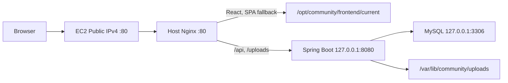
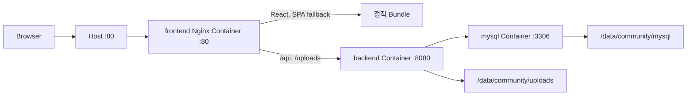

# 한 대의 EC2를 두 번 이해하기: 직접 설치와 Docker Compose로 PULSE 배포하기

- 작성일: 2026-08-05
- 서비스: PULSE Community
- Backend: Spring Boot 4, Java 21, MySQL
- Frontend: React 19, Webpack, Nginx

방식별 독립 문서는 다음과 같습니다.

- [A 방식: EC2 직접 설치 + Host Nginx](./DEPLOYMENT_METHOD_A_TECH_BLOG.md)
- [B 방식: 멀티스테이지 Image + Docker Compose](./DEPLOYMENT_METHOD_B_TECH_BLOG.md)

> 공개 서비스 주소: <https://pulse.gleeze.com/>
>
> A 방식 검증 단계: EC2 Public IPv4의 HTTP 80으로 접속했으며 Dynu와 HTTPS는
> 사용하지 않았습니다.
>
> B 방식 작업 단계: Docker Compose를 구성하면서 Dynu 고정 Hostname과 HTTPS를
> 처음 적용했습니다. B 방식 격리 검증 후 Container는 중지했으며, 최종 제출
> 주소는 Host Nginx가 제공하고 있습니다.

## 들어가며

솔직히 말하면 이번 배포 작업의 많은 부분을 AI에게 맡겼습니다. AI는 저장소를
분석하고, 배포 구조와 선택지를 제안하고, Script와 설정 파일을 작성하고,
오류 로그를 함께 읽으며 다음 검증 명령을 제시했습니다. 저는 AWS Console과
EC2에서 실제 작업을 수행하면서, AI가 보여준 선택지가 PULSE에 정말 적합한지
판단했습니다.

여기서 중요한 점은 AI의 첫 번째 제안을 그대로 사용하지 않았다는 것입니다.
비용만 보면 `t3.micro`가 적합하다는 제안을 받았지만, 현재의 작은 커뮤니티
기능만으로도 메모리 여유가 거의 사라질 수 있다고 판단해 `t3.small`을
선택했습니다. 무료 도메인도 처음에는 DuckDNS를 제안받았지만, 다른 서비스를
직접 비교한 뒤 설정 과정이 조금 더 필요하더라도 선택지가 넓은 Dynu로
바꿨습니다.

이번 협업에서 역할은 다음과 같이 나뉘었습니다.

| 구분 | 맡은 역할                                                                        |
| ---- | -------------------------------------------------------------------------------- |
| AI   | 코드와 설정 초안 작성, 대안 제시, 로그 분석, 검증 Script와 문서 작성             |
| 저   | 서비스 제약 정의, 비용·확장성 비교, 최종 옵션 선택, AWS·EC2 실제 실행, 결과 확인 |

결국 AI는 선택지를 넓히고 반복 작업을 빠르게 수행했으며, 저는 그중 어떤
선택이 현재 서비스에 맞는지 결정했습니다. 이 글은 완성된 설정만 보여주는
매뉴얼이 아니라, 그 선택과 시행착오를 실제 작업 순서대로 돌아보는
회고입니다.

이번 과제에서는 같은 React + Spring 서비스를 다음 두 방식으로 배포했습니다.

- **A 방식**: EC2 한 대에 Java, MySQL, Nginx를 직접 설치하고 systemd로
  Spring Boot를 운영합니다.
- **B 방식**: React와 Spring을 각각 멀티스테이지 Docker Image로 만들고,
  MySQL까지 Docker Compose로 묶습니다. Frontend Nginx Container만 외부에
  공개합니다.

표면적으로는 “Docker를 쓰느냐”의 차이처럼 보였습니다. 하지만 실제로는
배포 단위, 장애를 찾는 방법, Secret 전달, 파일 영속성, 롤백의 기준까지
달라지는 작업이었습니다. 그래서 단순히 명령어만 나열하지 않고 다음 순서로
접근했습니다.

1. 현재 구조에서 운영 장애가 날 지점을 먼저 찾습니다.
2. A와 B가 만족해야 하는 공통 보안 기준을 정합니다.
3. 코드로 반복할 수 있는 배포 절차를 만듭니다.
4. 정상 기동뿐 아니라 포트 격리, 권한, 재시작, 영속성까지 검증합니다.
5. 실제로 실패한 지점과 해결 과정을 기록합니다.

글의 전개 방식은 여러 기술 글과 공식 문서를 참고했지만, 본문에서 출처 설명이
작업 흐름을 끊지 않도록 분리했습니다. 링크별로 어떤 부분을 참고했고 이 글의
어디에 반영했는지는
[출처별 참고 지점](./DEPLOYMENT_TECH_BLOG_SOURCES.md)에 따로 정리했습니다.

또한 이 글과 출처 문서에는 제출 시 공개하면 안 되는 DB 비밀번호, JWT 원문,
Dynu IP Update Password, AWS 자격증명, 개인 키를 넣지 않습니다. 코드의
민감값은 `<secret>`과 같은 자리표시자로만 표현합니다.

---

## 1. 배포를 시작하기 전에 운영 정보를 먼저 고정합니다

### 1.1 배포 주소와 공개 상태

| 항목                      | 값                                           |
| ------------------------- | -------------------------------------------- |
| 최종 제출 주소            | <https://pulse.gleeze.com/>                  |
| A 방식 검증 주소          | `http://<검증 당시 EC2 Public IPv4>/`        |
| A 방식 Domain·TLS         | 사용하지 않음                                |
| B 방식 격리 검증 주소     | `http://127.0.0.1:18088`                     |
| B 작업 단계의 외부 진입점 | Dynu `pulse.gleeze.com`, Let's Encrypt HTTPS |
| 최종 실행 상태            | B Container 중지, Host Nginx가 80·443 제공   |

EC2 Public IPv4는 A 방식 검증 당시 `3.39.194.216`이었지만 Elastic IP를
사용하지 않으므로 Stop/Start 후 바뀔 수 있습니다. A 방식은 이 IP와 HTTP로
검증을 끝냈습니다. 이후 B 방식 작업 단계에서 Dynu와 HTTPS를 처음 추가했고,
Dynu Timer가 현재 Public IPv4를 고정 Hostname에 계속 반영하도록 구성했습니다.

### 1.2 비용을 아끼되 `t3.micro`를 고집하지 않은 이유

처음 AWS 구성을 정할 때 가장 먼저 생각한 것은 비용이었습니다. 그래서 EC2
한 대 안에 Nginx, Spring Boot, MySQL을 배치하고, RDS·ALB·NAT Gateway처럼
과제 규모에서 비용을 늘리는 별도 관리형 구성은 사용하지 않았습니다. 월 AWS
Budget은 15 USD, 실제 비용 알림은 12 USD로 설정했습니다. 이 알림은 비용을
자동으로 차단하는 장치가 아니므로, 사용하지 않는 시간에는 인스턴스를
중지하는 운영도 함께 고려했습니다.

AI가 처음 추천한 인스턴스는 비용이 더 낮은 `t3.micro`였습니다. `t3.micro`와
`t3.small`은 모두 2 vCPU지만 메모리는 각각 1GiB와 2GiB입니다. 처음에는
트래픽이 많지 않은 과제용 서비스이므로 `t3.micro`도 가능해 보였습니다.

하지만 PULSE는 아직 기능을 많이 추가하지 않은 상태인데도 Spring Boot JVM,
MySQL, Nginx와 운영체제가 함께 메모리를 사용하면서 용량을 거의 다 채울 수
있었습니다. 이후 B 방식 격리 검증에서도 세 Container의 한 시점 메모리
사용량만 합쳐 약 866.7MiB였습니다. 이 수치는 EC2에서 측정한 성능 지표는
아니지만, 운영체제와 Docker Daemon의 사용량까지 더하면 1GiB에서는 여유가
매우 작다는 판단 근거가 됐습니다.

```bash
# 인스턴스 선택과 배포 후 여유 자원을 확인할 때 사용한 명령입니다.
free -h
df -h /
sudo docker stats --no-stream
```

비용만 보면 `t3.micro`가 유리하지만, 기능을 조금만 추가해도 메모리 부족이나
Swap 의존으로 이어질 가능성이 있었습니다. 저는 월 비용이 늘어나는 것을
감수하고 `t3.small`을 선택했습니다. Root volume은 인스턴스 메모리와 별개로
Docker Image, MySQL 데이터, 업로드 파일이 쌓이는 것을 고려해 gp3 20GiB로
구성했습니다. 즉 가장 싼 구성을 고르는 대신, 비용 알림과 인스턴스 중지를
활용하면서 최소한의 운영 여유를 확보하는 쪽을 선택했습니다.

### 1.3 실제 검증된 EC2 환경

| 구분              | 실제 값                                     |
| ----------------- | ------------------------------------------- |
| AWS Region        | Asia Pacific (Seoul), `ap-northeast-2`      |
| AMI/OS            | Ubuntu Server 24.04 LTS                     |
| Architecture      | `x86_64`                                    |
| Instance type     | `t3.small`                                  |
| Root volume       | gp3 20 GiB, 암호화, 종료 시 삭제            |
| 접속              | AWS Systems Manager Session Manager         |
| IAM Role          | `community-ec2-ssm-role`                    |
| IAM Policy        | `AmazonSSMManagedInstanceCore`              |
| Instance Metadata | IMDSv2 Required, Hop limit 1                |
| Host Runtime      | OpenJDK 21.0.11, Nginx 1.24.0, MySQL 8.0.46 |
| 공개 Inbound      | TCP 80, 443                                 |
| 비공개 Port       | 22, 8080, 3306                              |
| 비용 기준         | 월 Budget 15 USD, Actual Alert 12 USD       |

SSH 22는 Artifact를 SCP로 옮길 때만 현재 공인 IP `/32`에 임시로 열었다가
전송 직후 삭제했습니다. 일상적인 운영 접속은 Key Pair가 필요 없는 Session
Manager를 사용합니다.

---

## 2. 과제 요구사항에 따라 두 가지 방식으로 나누어 진행했습니다

A와 B를 함께 적용한 이유는 제가 두 구조를 동시에 운영하기로 결정했기 때문이
아니라, 과제에서 직접 설치 방식과 Docker Compose 방식을 각각 구현하도록
요구했기 때문입니다. 먼저 A 방식으로 운영체제에 Java, MySQL, Nginx를 직접
설치했고, 이어서 같은 서비스를 B 방식의 Image와 Compose로 옮겼습니다.

A 방식은 각 서비스가 실제 Host에서 어떻게 연결되는지 확인하기 좋았습니다.
대신 패키지 설치, 사용자와 디렉터리 생성, MySQL 설정, systemd 등록, Nginx
설정을 순서대로 맞춰야 했습니다. 한 단계가 빠지면 뒤의 Script가 성공하지
않기 때문에 현재 Host 상태를 계속 확인해야 했습니다.

B 방식으로 옮긴 뒤에는 다음 작업이 편리해졌습니다.

- Java와 Node 버전을 Host에 각각 맞추는 대신 Dockerfile의 Builder Image로
  빌드 환경을 고정할 수 있었습니다.
- `docker compose up --wait` 한 번으로 MySQL → Backend → Frontend의 준비
  상태를 확인하며 실행할 수 있었습니다.
- Backend와 MySQL Port를 Host에 공개하지 않고 Compose Network 안에서만
  연결할 수 있었습니다.
- 같은 commit-tagged Image와 `.env`를 사용해 다른 환경에서도 같은 실행
  구성을 재현할 수 있었습니다.
- `current.env`와 `previous.env`를 이용해 현재와 이전 Release를 명확하게
  구분할 수 있었습니다.
- 서비스별 로그와 자원 사용량을 `docker compose logs`, `docker stats`로
  한 번에 확인할 수 있었습니다.

| 작업하며 느낀 차이 | A 방식                               | B 방식                                               |
| ------------------ | ------------------------------------ | ---------------------------------------------------- |
| 배포 단위          | JAR과 정적 Archive                   | commit-tagged Docker Image                           |
| Process 관리       | 각 systemd Service를 따로 관리       | Compose가 세 Service를 함께 관리                     |
| 실행 순서          | Script 순서와 현재 Host 상태에 의존  | `service_healthy` 조건으로 선언                      |
| Backend·DB 연결    | `127.0.0.1`과 Host 설정 사용         | Compose DNS인 `backend`, `mysql` 사용                |
| Secret             | root 소유 환경 파일                  | root 소유 파일과 Compose secrets                     |
| 롤백               | Backend·Frontend symlink를 함께 전환 | 이전 Image와 Release env를 전환                      |
| 편리했던 점        | OS 수준 동작을 직접 확인하기 쉬움    | 동일한 실행 환경을 다시 만들고 상태를 모아 보기 쉬움 |

B 방식이 모든 면에서 더 단순했던 것은 아닙니다. Image Platform, Volume,
Network, Container 권한까지 새로 확인해야 했습니다. 하지만 A 방식에서 여러
파일과 Service에 나뉘었던 운영 조건을 `Dockerfile`과 `compose.yaml`에 모아
볼 수 있다는 점이 가장 편리했습니다.

---

## 3. 브라우저가 Backend Port를 몰라도 되게 만듭니다

초기 Frontend는 현재 Host의 `:8080`으로 API를 호출했습니다. 이 상태에서는
브라우저가 Spring Boot에 직접 접근해야 하므로 Security Group에서 8080을
열어야 합니다. A/B 모두 외부에는 Nginx만 노출하려 했기 때문에 API 주소를
same-origin으로 바꿨습니다.

Frontend의 [`src/shared/config/env.js`](https://github.com/100-hours-a-week/KTB4-ian-community-FE/blob/main/src/shared/config/env.js)는 Local 개발일 때만
8080을 사용합니다.

```js
export function defaultApiBaseUrl(location = globalThis.location) {
  const resolvedLocation =
    typeof location === "string" ? { hostname: location } : location;
  const hostname = resolvedLocation?.hostname || "localhost";
  const isLocal = hostname === "localhost" || hostname === "127.0.0.1";

  if (isLocal) return `http://${hostname}:8080`;
  if (resolvedLocation?.origin && resolvedLocation.origin !== "null")
    return resolvedLocation.origin;

  return "";
}
```

운영 브라우저는 `/api`, `/uploads`만 호출합니다. A 방식 Nginx는 이를
`127.0.0.1:8080`으로, B 방식 Nginx는 Compose Service 이름
`backend:8080`으로 전달합니다. 이 구조 덕분에 CORS 범위가 단순해지고,
8080을 외부에 공개하지 않아도 됩니다.

---

## 4. A 방식: EC2에 직접 설치해 봅니다

### 4.1 최종 구조



A 방식 검증 시점에는 Dynu Domain과 HTTPS를 사용하지 않았습니다. 브라우저는
당시 EC2 Public IPv4의 HTTP 80으로 접속했고, Security Group도 검증에 필요한
HTTP 80만 허용했습니다.

Host에는 다음 세 서비스를 설치했습니다.

- `mysql.service`: 운영 데이터 저장
- `community-backend.service`: Spring Boot JAR 실행
- `nginx.service`: React 정적 파일 제공과 Reverse Proxy

### 4.2 환경 변수와 Secret

실제 값은 `/etc/community/backend.env`에 `root:community 640`으로 저장합니다.
검증 Script는 값 대신 `SET`/`MISSING`만 출력합니다.

```dotenv
SPRING_PROFILES_ACTIVE=aws
DB_URL=jdbc:mysql://127.0.0.1:3306/community?useUnicode=true&characterEncoding=utf8&serverTimezone=Asia/Seoul
DB_USERNAME=community_app
DB_PASSWORD=<secret>
JWT_SECRET=<base64-secret-decoding-to-at-least-32-bytes>
FRONTEND_ORIGIN=http://<ec2-public-ip>
COOKIE_SECURE=false
DB_POOL_MAX_SIZE=10
DB_POOL_MIN_IDLE=2
```

`DB_PASSWORD`, `JWT_SECRET`은 코드·문서·로그에 포함하지 않습니다. JWT 값은
단순 문자열이 아니라 Base64 디코딩 결과가 최소 32바이트여야 합니다.
`COOKIE_SECURE=false`는 A 방식의 HTTP 검증 단계에만 사용한 값입니다.

### 4.3 MySQL을 Loopback에 묶기

[`mysql/community.cnf.example`](./method-a/mysql/community.cnf.example)에서
MySQL과 MySQL X Protocol을 모두 Loopback에 묶었습니다.

```ini
[mysqld]
bind-address = 127.0.0.1
mysqlx-bind-address = 127.0.0.1
character-set-server = utf8mb4
collation-server = utf8mb4_0900_ai_ci
max_connections = 80
innodb_buffer_pool_size = 256M
slow_query_log = ON
long_query_time = 1
```

애플리케이션 계정은 평상시에 CRUD 권한만 가집니다. Flyway가 Schema를
변경해야 하는 배포 구간에만 DDL 권한을 부여하고, 성공·실패와 관계없이
Trap에서 회수합니다.

```bash
"${SCRIPT_DIR}/mysql-migration-access.sh" grant
migration_access_granted=true
systemctl restart community-backend.service

# Backend가 준비되면 다시 회수
"${SCRIPT_DIR}/mysql-migration-access.sh" revoke
migration_access_granted=false
```

### 4.4 운영 Profile은 생성보다 검증을 선택했습니다

[`application-aws.yaml`](../src/main/resources/application-aws.yaml)은 Flyway가
Schema를 만들고 Hibernate는 일치 여부만 확인하도록 구성했습니다.

```yaml
server:
  address: ${SERVER_ADDRESS:127.0.0.1}
  port: 8080
  shutdown: graceful

spring:
  datasource:
    url: ${DB_URL}
    username: ${DB_USERNAME}
    password: ${DB_PASSWORD}
  jpa:
    hibernate:
      ddl-auto: validate
    open-in-view: false
  flyway:
    enabled: true
    locations: classpath:db/migration/mysql
    clean-disabled: true
  h2:
    console:
      enabled: false
```

운영에서 `ddl-auto=create`나 `update`를 사용하면 애플리케이션 시작이 곧
암묵적인 Schema 변경으로 이어집니다. 그래서 Migration 파일을 배포 이력으로
남기고, Hibernate에는 검증만 맡겼습니다. H2 Console도 AWS Profile에서는
비활성화했습니다.

### 4.5 JAR을 root가 아닌 전용 사용자로 실행하기

[`community-backend.service`](./method-a/systemd/community-backend.service)는
로그인 Shell이 없는 `community` 사용자로 Spring Boot를 실행합니다.

```ini
[Service]
User=community
Group=community
EnvironmentFile=/etc/community/backend.env
ExecStart=/usr/bin/java -Xms256m -Xmx640m \
  -jar /opt/community/backend/app.jar
Restart=on-failure
UMask=0027

NoNewPrivileges=true
PrivateTmp=true
PrivateDevices=true
ProtectHome=true
ProtectSystem=strict
CapabilityBoundingSet=
ReadWritePaths=/var/lib/community/uploads
```

Filesystem 대부분은 읽기 전용으로 보고, 이미지 Upload 경로만 명시적으로
쓰기 허용했습니다. `app.jar`는 실제 Release JAR을 가리키는 symlink입니다.

### 4.6 Nginx가 정적 파일과 API를 나누는 방법

공통 애플리케이션 설정은
[`community-app.conf`](./method-a/nginx/community-app.conf)에 모았습니다.

```nginx
root /opt/community/frontend/current;
index index.html;
client_max_body_size 11m;

location /api/ {
    proxy_pass http://127.0.0.1:8080;
    proxy_set_header Host $host;
    proxy_set_header X-Real-IP $remote_addr;
    proxy_set_header X-Forwarded-For $proxy_add_x_forwarded_for;
    proxy_set_header X-Forwarded-Proto $scheme;
}

location /uploads/ {
    proxy_pass http://127.0.0.1:8080;
    proxy_set_header Host $host;
    proxy_set_header X-Forwarded-Proto $scheme;
}

location / {
    try_files $uri $uri/ /index.html;
}
```

`try_files ... /index.html`은 `/feed`, `/posts/1`처럼 파일로 존재하지 않는
React Router 경로를 새로고침해도 SPA가 열리게 합니다. `.env`, PEM, SQL,
Dump, Backup 확장자는 Nginx에서 한 번 더 차단했습니다.

### 4.7 A 방식에서 실패한 작업과 수정 과정

#### EC2에 없는 Artifact를 바로 풀려고 했습니다

처음에는 Session Manager에서 `/tmp/community-method-a.tar.gz`를 바로
압축 해제하려고 했습니다. 하지만 이 파일은 로컬 Mac에서 만든 뒤 EC2로
전송해야 하는 Artifact였고, EC2에는 아직 존재하지 않았습니다.

```text
tar: /tmp/community-method-a.tar.gz: Cannot open: No such file or directory
```

작업을 로컬 생성, 전송, EC2 설치의 세 단계로 다시 나눴습니다. 먼저 Backend
저장소의 Mac Terminal에서 테스트와 JAR Build, 배포 Bundle 생성을
진행했습니다.

```bash
# 실행 위치: 로컬 Mac Terminal의 Backend 저장소
./gradlew clean test bootJar
mkdir -p /tmp/community-artifacts
cp build/libs/community-0.0.1-SNAPSHOT.jar \
  /tmp/community-artifacts/community-backend.jar
tar -czf /tmp/community-method-a.tar.gz \
  -C deployment method-a
```

Frontend 저장소에서도 정적 파일을 만들고 Archive로 묶었습니다.

```bash
# 실행 위치: 로컬 Mac Terminal의 Frontend 저장소
npm run format:check
npm run test:unit
npm run test:integration
npm run build:react
tar -czf /tmp/community-artifacts/community-frontend.tar.gz \
  index.html dist
```

그다음 SSH 22를 제 Public IP `/32`에만 잠깐 허용하고 로컬 Terminal에서
세 Artifact를 전송했습니다. `<...>` 부분에는 로컬에만 있는 값이 들어가며,
실제 Private Key 경로는 문서에 기록하지 않습니다.

```bash
# 실행 위치: 로컬 Mac Terminal
ssh -i <private-key-path> \
  ubuntu@<ec2-public-ip> 'mkdir -p /tmp/community-artifacts'

scp -i <private-key-path> \
  /tmp/community-method-a.tar.gz \
  ubuntu@<ec2-public-ip>:/tmp/

scp -i <private-key-path> -r \
  /tmp/community-artifacts \
  ubuntu@<ec2-public-ip>:/tmp/
```

전송이 끝난 뒤 22번 규칙을 삭제하고, 이후 작업은 다시 Session Manager에서
진행했습니다.

#### 패키지 설치만으로 배포가 끝난다고 생각했습니다

초기에 `verify.sh`를 먼저 실행했을 때 MySQL, Backend, Nginx가 모두 active가
아니라는 결과가 나왔습니다. 이후 `01-install-packages.sh`를 실행했지만 이
Script는 Java, MySQL, Nginx를 설치할 뿐, 서비스 계정·DB·환경 파일·JAR·정적
파일까지 배포하지는 않습니다.

```text
FAIL: mysql is not active
FAIL: community-backend is not active
FAIL: nginx is not active
```

그래서 설치 Script의 역할을 확인하고 다음 순서로 다시 실행했습니다.

```bash
# 실행 위치: EC2 Session Manager
deployment_tmp="$(mktemp -d /tmp/community-method-a.XXXXXX)"
sudo tar -xzf /tmp/community-method-a.tar.gz -C "${deployment_tmp}"
cd "${deployment_tmp}/method-a"
sudo scripts/01-install-packages.sh
sudo scripts/02-configure-user-and-directories.sh
sudo scripts/03-configure-mysql.sh
sudo scripts/install-operations.sh

cd /opt/community/deployment/method-a
sudo scripts/configure-backend-env.sh
sudo scripts/deploy.sh
sudo scripts/verify.sh
```

각 Script를 분리한 이유는 실패 지점을 바로 찾기 위해서입니다. `01`은 OS
Package, `02`는 사용자와 경로, `03`은 Loopback MySQL, `configure`는 Secret
환경 파일, `deploy`는 JAR·Frontend·systemd·Nginx를 담당합니다.

#### Shell Prompt와 명령을 함께 붙여 넣었습니다

한 번은 화면에 보이는 `$` Prompt까지 복사하고 여러 명령 사이의 줄바꿈이
사라져 `verify.shsudo`처럼 합쳐졌습니다. `$`는 입력할 문자가 아니며, 명령은
한 줄씩 실행한 뒤 결과를 확인하도록 바꿨습니다.

```bash
# 실행 위치: EC2 Session Manager
cd /opt/community/deployment/method-a
sudo scripts/deploy.sh
sudo scripts/verify.sh
```

수정 후 A 방식은 EC2 Public IPv4의 HTTP 80에서 React, `/api`, `/uploads`를
검증했습니다. 이 단계에는 Dynu와 HTTPS가 포함되지 않았습니다.

### 4.8 Release와 롤백

Backend와 Frontend를 덮어쓰지 않고 Timestamp Release로 설치했습니다.

```text
/opt/community/backend/releases/community-<UTC>.jar
/opt/community/backend/app.jar -> 선택된 JAR

/opt/community/frontend/releases/<UTC>/
/opt/community/frontend/current -> 선택된 정적 Release
```

Frontend Archive는 압축을 풀기 전에 절대 경로와 `..` 경로를 차단합니다.

```bash
if tar -tzf "${FRONTEND_ARTIFACT}" |
  awk 'BEGIN{bad=0} /^\// || /(^|\/)\.\.(\/|$)/ {bad=1} END{exit bad ? 0 : 1}'; then
  echo "Frontend artifact contains an unsafe path." >&2
  exit 1
fi
```

이전 Backend와 Frontend symlink를 함께 복구해야 화면과 API 계약이 어긋나지
않습니다. Backup은 `mysqldump`, Upload Archive와 SHA-256을 한 세트로 만들고,
Restore에는 명시적인 확인 Token을 요구합니다.

### 4.9 실제 실행 순서

A 방식은 실행 위치를 섞지 않는 것이 중요했습니다.

| 실행 위치            | 사용한 명령                            | 역할                                        |
| -------------------- | -------------------------------------- | ------------------------------------------- |
| 로컬 Backend 저장소  | `./gradlew clean test bootJar`         | 테스트 후 배포 JAR 생성                     |
| 로컬 Frontend 저장소 | `npm run build:react`                  | Nginx가 제공할 정적 파일 생성               |
| 로컬 Mac Terminal    | `scp ... ubuntu@<ec2-public-ip>:/tmp/` | Artifact를 EC2로 전송                       |
| EC2 Session Manager  | `uname`, `df`, `free`, `ss`            | Architecture·Disk·Memory·Listener 사전 확인 |
| EC2 Session Manager  | `01`~`03`, `install-operations.sh`     | Package·사용자·MySQL·운영 Script 준비       |
| EC2 Session Manager  | `configure-backend-env.sh`             | 실제 값을 출력하지 않고 환경 파일 생성      |
| EC2 Session Manager  | `deploy.sh`, `verify.sh`               | Release 적용과 HTTP 상태 검증               |

EC2에 접속한 직후에는 먼저 배포 가능한 환경인지 확인했습니다.

```bash
# 실행 위치: EC2 Session Manager
uname -a
uname -m
df -h /
free -h
sudo ss -lntup
```

Artifact를 `/tmp` 아래에 준비한 후 임시 디렉터리를 만들고 Bundle을 푼 다음,
그 안의 Script로 직접 설치와 배포를 진행했습니다. `mktemp`가 출력한 실제
경로를 변수에 보관하므로 Prompt에 경로를 다시 입력할 필요가 없습니다.

```bash
# 실행 위치: EC2 Session Manager
deployment_tmp="$(mktemp -d /tmp/community-method-a.XXXXXX)"
sudo tar -xzf /tmp/community-method-a.tar.gz -C "${deployment_tmp}"
cd "${deployment_tmp}/method-a"

sudo scripts/01-install-packages.sh
sudo scripts/02-configure-user-and-directories.sh
sudo scripts/03-configure-mysql.sh
sudo scripts/install-operations.sh

cd /opt/community/deployment/method-a
sudo scripts/configure-backend-env.sh
sudo scripts/deploy.sh
sudo scripts/verify.sh
```

마지막 `verify.sh`는 단순히 홈페이지가 열리는지만 확인하지 않습니다. MySQL,
Spring Boot, Nginx의 상태와 `127.0.0.1:8080`, `127.0.0.1:3306` Listener,
H2 Console 차단, 환경 파일 권한, Upload 권한, HTTP Health를 함께 검사합니다.
A 방식 완료 기준은 EC2 Public IPv4의 HTTP 주소에서 이 검사가 통과하는
것이었습니다.

---

## 5. A 방식에서 B 방식으로 넘어가며 관점 차이를 발견했습니다

A 방식에서 EC2 Public IPv4의 HTTP 접속까지 확인한 뒤, 같은 프로젝트를
Docker Compose로 옮기는 B 방식을 시작했습니다. Dynu Domain과 HTTPS도 이 B
방식 작업 단계에서 처음 추가했습니다. 저는 이를 “같은 EC2에서 A 방식을
완성한 다음 B 방식으로 전환하고, 두 결과를 모두 증명하는 과정”으로 보고
있었습니다. 반면 AI는 A와 B를 서로 독립적으로 완성하고 검증할 수 있는 두
배포 산출물로 바라보고 있었습니다.

두 관점 모두 틀린 것은 아니지만, 초기에 서로 다르게 보고 있다는 사실을
알아채지 못했습니다. 그 결과 AI는 B 방식의 격리 검증을 우선 진행했고, 저는
EC2의 기존 A 방식 공개 상태를 유지한 채 B 방식도 확인하려 했습니다. 두
방식의 Nginx가 모두 Host 80번 포트를 사용한다는 점이 실제 실행 단계에서야
문제가 됐고, 원인을 확인하고 운영 상태를 다시 정리하는 데 시간이 더
들었습니다.

```bash
# Host 80번 포트를 누가 사용하고 있는지 확인했습니다.
sudo ss -ltnp | grep ':80'
sudo docker ps --filter publish=80 \
  --format 'table {{.Names}}\t{{.Ports}}\t{{.Status}}'
sudo systemctl status nginx --no-pager
```

이때부터 “두 방식을 모두 구현한다”와 “두 방식을 동시에 공개한다”를 구분하기
시작했습니다. 한 대의 EC2에서 같은 80번 포트를 공유하므로 동시에 공개하지
않고, B 방식은 격리된 포트에서 전체 검증한 뒤 중지했습니다. 최종 제출
상태에서는 B 단계에서 만든 Dynu·HTTPS 설정을 유지한 채 Host Nginx를 다시
80·443의 소유자로 선택했습니다.

A 방식에서 정한 운영 원칙은 B 방식으로 자연스럽게 이어졌습니다.

| A 방식에서 확인한 원칙                    | B 방식에서 옮긴 방법                                         |
| ----------------------------------------- | ------------------------------------------------------------ |
| systemd가 Spring Boot의 재시작을 관리함   | Compose의 restart 정책과 healthcheck로 표현함                |
| Backend와 MySQL은 Loopback에서만 접근함   | Compose Network의 `expose`만 사용하고 Host port는 열지 않음  |
| Nginx만 브라우저 요청을 받음              | Frontend Nginx Container만 Host port를 publish함             |
| 환경 파일의 Secret을 root 권한으로 보호함 | Compose secrets와 Config Tree로 필요한 Container에만 전달함  |
| Release symlink로 현재·이전 버전을 관리함 | commit-tagged Image와 `current.env`, `previous.env`로 관리함 |

즉 B 방식은 A 방식을 버리고 새로 시작한 작업이 아니라, A 방식에서 직접
확인한 운영 규칙을 Container와 Compose 선언으로 옮기는 작업이었습니다.

---

## 6. B 방식: 멀티스테이지 Image와 Compose로 묶어 봅니다

### 6.1 최종 구조



Compose Network 안에서는 Service 이름이 DNS가 됩니다. Host에 공개되는 포트는
Frontend의 80 하나뿐이고 Backend와 MySQL은 `expose`만 사용합니다.
이 그림은 B 방식 Container 실행 구조를 나타냅니다. Dynu와 TLS는 B 작업
단계에서 이 구조 앞에 추가한 Host 진입점이며, 격리 검증에서는 충돌을 피하려고
Frontend를 `127.0.0.1:18088`에 연결했습니다.

### 6.2 Spring Boot 멀티스테이지 Dockerfile

Backend [`Dockerfile`](../Dockerfile)은 JDK Builder에서 테스트와 Boot JAR
생성을 수행하고, Runtime에는 JRE와 결과물만 남깁니다.

```dockerfile
FROM ${JDK_IMAGE} AS builder
WORKDIR /workspace
COPY gradlew build.gradle settings.gradle ./
COPY gradle ./gradle
COPY src ./src
RUN --mount=type=cache,target=/root/.gradle \
    ./gradlew --no-daemon clean test bootJar

FROM ${JRE_IMAGE} AS runtime
RUN groupadd --gid 10001 community \
    && useradd --uid 10001 --gid community \
       --home-dir /nonexistent --no-create-home \
       --shell /usr/sbin/nologin community

COPY --from=builder --chown=community:community \
    /workspace/build/libs/community.jar /app/community.jar
USER community:community
ENTRYPOINT ["java", "-jar", "/app/community.jar"]
```

JDK는 빌드에만 필요합니다. Runtime을 JRE로 줄이고 UID/GID `10001`의
non-root 사용자로 고정했습니다. Base Image는 Tag뿐 아니라 Digest까지
고정해 같은 Commit을 다시 빌드할 때 기반 Image가 임의로 바뀌는 범위를
줄였습니다.

### 6.3 React 멀티스테이지 Dockerfile

Frontend [`Dockerfile`](https://github.com/100-hours-a-week/KTB4-ian-community-FE/blob/main/Dockerfile)은 Node에서 Webpack Build를 하고 Nginx Runtime에는
정적 산출물만 복사합니다.

```dockerfile
FROM node:24.14.0-alpine3.23 AS builder
WORKDIR /app
COPY package.json package-lock.json ./
RUN npm ci --no-audit --no-fund
COPY index.html webpack.config.js ./
COPY src ./src
RUN npm run build:react \
    && find dist -type f -name '*.map' -delete

FROM nginx:1.28.2-alpine3.23 AS runtime
COPY docker/nginx.conf /etc/nginx/nginx.conf
COPY --from=builder --chown=nginx:nginx \
    /app/index.html /usr/share/nginx/html/index.html
COPY --from=builder --chown=nginx:nginx \
    /app/dist /usr/share/nginx/html/dist
USER nginx
```

검증 단계에서 Runtime Container 안에 `node` 명령이 없음을 확인했습니다.
Browser Bundle에 DB/JWT/AWS Secret을 전달하는 Build Argument도 사용하지
않았습니다.

### 6.4 Container Nginx Reverse Proxy

[`docker/nginx.conf`](https://github.com/100-hours-a-week/KTB4-ian-community-FE/blob/main/docker/nginx.conf)는 정적 파일, SPA Fallback, API Proxy를 한 곳에서
처리합니다.

```nginx
location /dist/ {
    try_files $uri =404;
    expires 1y;
    add_header Cache-Control "public, max-age=31536000, immutable" always;
}

location /api/ {
    proxy_pass http://backend:8080;
    proxy_set_header X-Forwarded-For $proxy_add_x_forwarded_for;
    proxy_set_header X-Forwarded-Proto $scheme;
}

location / {
    try_files $uri $uri/ /index.html;
    add_header Cache-Control "no-store, no-cache, must-revalidate" always;
}
```

Hash 없이 배포되는 `index.html`은 캐시하지 않고, 정적 Bundle은 immutable
Cache를 적용했습니다. Nginx가 read-only root filesystem에서도 동작하도록
모든 임시 경로를 `/tmp`로 옮겼습니다.

### 6.5 Compose에서 격리와 의존성을 표현하기

핵심 구성은 [`compose.yaml`](./ec2-compose/compose.yaml)에 선언했습니다.

```yaml
services:
  mysql:
    image: ${MYSQL_IMAGE}
    expose: ["3306"]
    volumes:
      - ${DATA_ROOT}/mysql:/var/lib/mysql
    healthcheck:
      test: ["CMD", "mysqladmin", "ping", "--host=127.0.0.1", "--silent"]

  backend:
    image: ${BACKEND_IMAGE}
    user: "10001:10001"
    expose: ["8080"]
    read_only: true
    depends_on:
      mysql:
        condition: service_healthy
    volumes:
      - ${DATA_ROOT}/uploads:/var/lib/community/uploads

  frontend:
    image: ${FRONTEND_IMAGE}
    ports:
      - "${HTTP_BIND_ADDRESS}:${HTTP_PORT}:80"
    read_only: true
    depends_on:
      backend:
        condition: service_healthy
```

단순한 시작 순서가 아니라 `service_healthy`를 조건으로 사용했습니다. MySQL이
준비된 뒤 Backend를, Backend가 준비된 뒤 Frontend를 시작합니다.
애플리케이션 Container에는 `privileged=false`, `no-new-privileges`,
`cap_drop: ALL`, PID/CPU/Memory Limit을 적용했습니다.

### 6.6 B 방식 환경 변수와 Secret

공개 가능한 Release 설정은 `.env`, 실제 Secret은 별도 파일로 분리합니다.

```dotenv
FRONTEND_IMAGE=community-frontend:<commit-sha>
BACKEND_IMAGE=community-backend:<commit-sha>
MYSQL_IMAGE=mysql:8.4.7
MYSQL_DATABASE=community
DB_USERNAME=community

DATA_ROOT=/data/community
SECRETS_DIR=/etc/community/secrets
HTTP_BIND_ADDRESS=0.0.0.0
HTTP_PORT=80

FRONTEND_ORIGIN=http://<ec2-domain-or-ip>
COOKIE_SECURE=false
DB_POOL_MAX_SIZE=8
DB_POOL_MIN_IDLE=1
JAVA_TOOL_OPTIONS=-Xms256m -Xmx640m -XX:+ExitOnOutOfMemoryError
```

B 방식의 격리 검증에서는 Domain과 무관한 Loopback HTTP를 사용했기 때문에
다음 값을 사용했습니다.

```dotenv
HTTP_BIND_ADDRESS=127.0.0.1
HTTP_PORT=18088
FRONTEND_ORIGIN=http://127.0.0.1:18088
COOKIE_SECURE=false
```

Secret 파일은 다음 세 개입니다.

```text
/etc/community/secrets/mysql-root-password
/etc/community/secrets/mysql-app-password
/etc/community/secrets/jwt-secret
```

소유권은 `root:community-secrets`, 권한은 `0640`입니다. Compose는 필요한
Container에만 파일을 Mount합니다. Backend는 Config Tree로 파일명을 환경 변수
이름처럼 읽습니다.

```yaml
environment:
  SPRING_CONFIG_IMPORT: optional:configtree:/run/secrets/
secrets:
  - source: mysql_app_password
    target: DB_PASSWORD
  - source: jwt_secret
    target: JWT_SECRET
```

### 6.7 commit-tagged Image와 Release 승격

`latest` 대신 Commit 기반 Tag를 사용하고 EC2 대상 Platform을
`linux/amd64`로 고정했습니다.

```bash
docker buildx build \
  --platform linux/amd64 \
  --load \
  --tag "community-backend:${commit_sha}" \
  .
```

Image Tar와 `SHA256SUMS`를 EC2로 전달한 뒤 Checksum이 일치할 때만 Load합니다.
[`deploy.sh`](./ec2-compose/scripts/deploy.sh)는 세 Container가 모두 healthy가
되어야 새 Release를 `current.env`로 승격합니다.

```bash
if ! docker compose --env-file "${release_env}" \
  --file compose.yaml up --detach --remove-orphans \
  --wait --wait-timeout 240; then
  echo "Deployment failed. current.env was not promoted." >&2
  exit 1
fi
```

실패한 Release가 현재 상태를 덮어쓰지 않게 한 것이 핵심입니다. 이전 env와
manifest는 `previous.*`로 보관해 롤백에 사용합니다.

### 6.8 실제 실행 순서

B 방식은 로컬에서 Image를 만든 뒤 EC2로 전달하는 흐름으로 진행했습니다.
먼저 Frontend 저장소의 Mac Terminal에서 `linux/amd64` Image를 만들고,
Container 단독 검증으로 SPA Fallback과 `/api` Proxy를 확인했습니다.

```bash
# 실행 위치: 로컬 Mac Terminal의 Frontend 저장소
./scripts/build-image.sh
IMAGE_TAG=community-frontend:<frontend-commit-sha> \
  ./scripts/verify-image.sh
```

`build-image.sh`는 Git commit으로 Image Tag를 만들고 React 멀티스테이지
Dockerfile을 빌드합니다. `verify-image.sh`는 Runtime이 non-root인지, Node.js가
남아 있지 않은지, Nginx가 SPA와 API Proxy를 처리하는지 확인합니다.

Backend 저장소에서도 같은 EC2 Architecture로 Image를 만들고 세 Image를 Tar와
Checksum으로 묶었습니다.

```bash
# 실행 위치: 로컬 Mac Terminal의 Backend 저장소
./deployment/ec2-compose/scripts/build-backend-image.sh

RELEASE_ENV=<completed-release-env-path> \
OUTPUT_DIR=<private-artifact-directory> \
  ./deployment/ec2-compose/scripts/package-images.sh
```

`build-backend-image.sh`는 JDK Builder에서 Gradle Test와 Boot JAR 생성을
실행하고 JRE Runtime Image를 만듭니다. `package-images.sh`는 Frontend,
Backend, MySQL의 `linux/amd64` Image만 Tar로 저장하고 `SHA256SUMS`를
생성합니다. Image와 Checksum은 Git에 추가하지 않았습니다. 전송할 때는 A
방식과 마찬가지로 SSH 22를 현재 Public IP `/32`에만 잠시 허용한 후, 로컬 Mac
Terminal에서 다음과 같이 EC2의 임시 경로로 옮겼습니다.

```bash
# 실행 위치: 로컬 Mac Terminal
scp -i <private-key-path> -r \
  <private-artifact-directory>/<release-id> \
  ubuntu@<ec2-public-ip>:/tmp/
```

전송 직후 22번 Inbound 규칙을 다시 삭제했습니다. Private Key 경로는 문서나
Git에 기록하지 않았습니다.

EC2에서는 Session Manager로 접속해 다음 명령을 실행했습니다.

```bash
# 실행 위치: EC2 Session Manager
cd /opt/community/deployment/ec2-compose

sudo ./scripts/install-docker.sh
sudo ./scripts/prepare-directories.sh

# 실제 값은 명령 인자가 아니라 권한이 제한된 파일에 입력했습니다.
sudoedit /etc/community/secrets/mysql-root-password
sudoedit /etc/community/secrets/mysql-app-password
sudoedit /etc/community/secrets/jwt-secret

sudo install -d -o root -g root -m 0700 \
  /opt/community/artifacts/<release-id>
sudo cp -R /tmp/<release-id>/. \
  /opt/community/artifacts/<release-id>/

sudo ARTIFACT_DIR=/opt/community/artifacts/<release-id> \
  ./scripts/load-images.sh
sudo ./scripts/deploy.sh
sudo ./scripts/verify.sh

sudo docker compose \
  --env-file /data/community/releases/current.env \
  --file compose.yaml ps
sudo docker stats --no-stream
```

`install-docker.sh`는 Docker Engine·Buildx·Compose Plugin을 설치하고,
`prepare-directories.sh`는 데이터·Release·Secret 경로와 권한을 만듭니다.
`load-images.sh`는 `SHA256SUMS`가 모두 일치해야 Image를 Load합니다.
`deploy.sh`는 세 Container가 healthy가 된 뒤에만 Release를 승격하고,
`verify.sh`는 Platform, User, read-only Filesystem, Port, Proxy, Health를
검사합니다. 마지막 `ps`와 `stats`는 서비스 상태와 실제 자원 사용량을 사람이
다시 확인하기 위해 실행했습니다.

### 6.9 B 방식 작업에서 Dynu와 HTTPS를 처음 적용했습니다

A 방식은 EC2 Public IPv4와 HTTP로 검증을 끝냈습니다. 고정 주소와 HTTPS는 B
방식을 진행하면서 처음 추가했습니다. AI가 처음 제안한 무료 DDNS는
DuckDNS였습니다. Token을 이용한 HTTPS 요청으로 IP를 간단하게 갱신할 수 있기
때문입니다.

저는 다른 무료 DDNS도 확인했고, 설정 단계가 조금 더 필요하더라도 사용할 수
있는 DNS Record와 IP 갱신 방식이 넓은 Dynu를 선택했습니다.

| 비교 기준            | DuckDNS                            | Dynu                                                             |
| -------------------- | ---------------------------------- | ---------------------------------------------------------------- |
| 시작 난이도          | Token과 HTTPS 요청 중심으로 단순함 | 계정·Hostname·별도 갱신 비밀번호 설정이 필요함                   |
| 공식 문서의 DNS 범위 | IP 갱신과 TXT Record API 중심      | A, AAAA, CAA, CNAME, MX, PTR, SPF, TXT 등 다양한 Record 지원     |
| IP 갱신              | IPv4·IPv6와 복수 Domain 갱신 지원  | Client·Script·API, Primary·Alias·Group·복수 Hostname 갱신 지원   |
| 확장 선택지          | 빠르게 한 주소를 연결하기에 적합함 | Wildcard, Alias, Web Redirect, 자체 Domain 연결 등 선택지가 넓음 |

최종적으로 `pulse.gleeze.com`을 만들고, EC2 Public IPv4가 바뀌어도 같은 주소를
사용할 수 있도록 10분 주기의 systemd Timer를 설치했습니다.

```ini
# community-dynu.timer
[Timer]
OnBootSec=30s
OnUnitActiveSec=10min
AccuracySec=30s
Unit=community-dynu.service
```

TLS는 HTTP-01 Challenge를 먼저 제공한 뒤 인증서 발급이 끝나면 80을 HTTPS로
Redirect하고 443에서 TLS를 종료하도록 구성했습니다.

```nginx
server {
    listen 80 default_server;
    server_name pulse.gleeze.com;

    location ^~ /.well-known/acme-challenge/ {
        root /var/www/letsencrypt;
        try_files $uri =404;
    }

    location / {
        return 301 https://pulse.gleeze.com$request_uri;
    }
}

server {
    listen 443 ssl http2 default_server;
    server_name pulse.gleeze.com;
    ssl_certificate /etc/letsencrypt/live/pulse.gleeze.com/fullchain.pem;
    ssl_certificate_key /etc/letsencrypt/live/pulse.gleeze.com/privkey.pem;
    ssl_protocols TLSv1.2 TLSv1.3;

    include /etc/nginx/snippets/community-app.conf;
}
```

실제 설정 명령은 EC2 Session Manager에서 실행했습니다. 이 작업은 B Container
자체에 인증서를 넣은 것이 아니라 EC2의 공통 Host 진입점을 만든 작업입니다.
Script 파일은 Host Nginx 설정을 재사용하기 때문에 `method-a` 운영 Bundle 안에
있지만, 실제로 처음 실행한 시점은 B 방식 작업 단계였습니다.

```bash
# 실행 위치: EC2 Session Manager
cd /opt/community/deployment/method-a
sudo scripts/08-configure-free-domain-https.sh
sudo scripts/verify.sh
```

Script는 Dynu Hostname, 인증서 알림용 Email, 별도 IP Update Password를 숨김
입력으로 받습니다. 실제 비밀번호는 문서나 명령행에 넣지 않습니다. 공개
진입점이 준비된 뒤에는 Backend Origin과 Cookie 정책도 HTTPS에 맞게
변경했습니다.

```dotenv
FRONTEND_ORIGIN=https://pulse.gleeze.com
COOKIE_SECURE=true
```

### 6.10 B 방식에서 실패한 작업과 수정 과정

#### Apple Silicon Image를 EC2에서 그대로 사용할 수 없었습니다

로컬 Mac은 `arm64`, EC2는 `x86_64`였습니다. 기본 `docker build` 결과를 그대로
전달하면 실행 Architecture가 달라질 수 있어 모든 Release Image를
`linux/amd64`로 고정했습니다.

```bash
# 실행 위치: 로컬 Mac Terminal
docker buildx build \
  --platform linux/amd64 \
  --load \
  --tag community-backend:<backend-commit-sha> .

docker image inspect \
  --platform linux/amd64 \
  --format '{{.Os}}/{{.Architecture}}' \
  community-backend:<backend-commit-sha>
```

검사 결과가 `linux/amd64`가 아닐 때는 Packaging과 배포를 중단하도록 Script에도
같은 검사를 넣었습니다.

#### Frontend Container와 Host Nginx가 80번 포트를 함께 사용했습니다

B 방식 Frontend Container가 `0.0.0.0:80->80`을 사용한 상태에서 Host Nginx를
시작하자 `nginx -t`는 통과했지만 Service 기동은 실패했습니다.

```text
nginx: [emerg] bind() to 0.0.0.0:80 failed (98: Address already in use)
```

문법과 실제 Port 점유는 다른 검사라는 것을 확인하고 다음 명령으로 점유자를
찾았습니다.

```bash
# 실행 위치: EC2 Session Manager
sudo nginx -t
sudo ss -ltnp | grep ':80'
sudo docker ps --filter publish=80 \
  --format 'table {{.Names}}\t{{.Ports}}\t{{.Status}}'
```

두 방식을 동시에 공개하지 않기로 정한 뒤, B 전체 검증은
`127.0.0.1:18088`에서 진행했습니다. 검증 후 Frontend Container를 중지하고
Host Nginx를 80·443의 최종 진입점으로 다시 시작했습니다.

#### Dynu가 첫 IP 갱신 요청을 거부했습니다

Dynu 계정 로그인 비밀번호와 IP Update Password를 같은 값으로 생각해 갱신이
거부됐습니다. Dynu에서 별도의 16자 이상 IP Update Password를 만든 뒤 다시
실행했습니다. Script는 원문 대신 SHA-256으로 처리한 값만 `root:root 600`
파일에 저장합니다.

```bash
# 실행 위치: EC2 Session Manager
sudo scripts/08-configure-free-domain-https.sh
sudo systemctl status community-dynu.timer --no-pager
```

#### Let's Encrypt가 EC2에 접속하지 못했습니다

첫 인증서 요청은 CA가 HTTP-01 Challenge URL에 연결하지 못해 Timeout이
발생했습니다. Nginx 문법 문제가 아니라 Security Group의 80번이 외부에 열려
있지 않은 것이 원인이었습니다. AWS Console에서 80과 443을 공개한 뒤 HTTP
응답 경로를 확인하고 Script를 다시 실행했습니다. 실제 Challenge 파일은
Certbot이 생성하므로 임의 파일명을 문서에 넣지 않았습니다.

```bash
# 실행 위치: EC2 Session Manager
curl -I http://pulse.gleeze.com/healthz
sudo scripts/08-configure-free-domain-https.sh
sudo certbot renew --dry-run --run-deploy-hooks
```

#### 테스트 JWT Secret의 형식이 운영 조건과 달랐습니다

B 방식 격리 검증에서 일반 문자열을 JWT Secret으로 사용하자 Backend가 시작
단계에서 이를 거부했습니다.

```text
JWT 비밀키는 Base64 형식이어야 합니다.
```

Base64 디코딩 결과가 32바이트 이상인 별도 테스트 값을 Secret 파일에 넣고
Container를 재생성했습니다. 실제 값은 출력하거나 저장소에 기록하지
않았습니다.

---

## 7. 무엇을 보고 “배포 성공”이라고 판단했을까요?

### 7.1 A 방식 검증

[`verify.sh`](./method-a/scripts/verify.sh)는 단순 HTTP 200보다 더 많은 것을
검사합니다.

- MySQL, Spring Boot, Nginx active
- Nginx 문법 정상
- Spring Boot 8080과 MySQL 3306이 Loopback에서만 Listen
- H2 Console 비공개
- 환경 파일 `root:community 640`
- Upload 경로가 world-writable이 아님
- EC2 Public IPv4의 HTTP `/healthz`와 React 화면 응답
- Security Group에서 22·443·8080·3306 미공개

최종 확인 결과는 다음과 같습니다.

| 검증                                  | 결과          |
| ------------------------------------- | ------------- |
| `http://<검증 당시 EC2 Public IPv4>/` | HTTP 200      |
| MySQL·Backend·Nginx                   | active        |
| 8080·3306                             | Loopback only |
| 22·443·8080·3306 외부 접근            | 차단          |
| 재부팅 후 DB·Upload                   | 유지          |
| Backup·Restore                        | 성공          |
| Release Rollback·복귀                 | 성공          |

상세 증빙은 [A 방식 검증 보고서](./method-a/docs/VALIDATION_REPORT.md)에
기록했습니다.

### 7.2 B 방식 검증

B 방식은 Apple Silicon 개발 장비에서 EC2 대상 `linux/amd64` Image를
에뮬레이션해 격리된 Compose Project로 최종 검증했습니다. 테스트용 Secret과
데이터만 사용했고 종료 후 Container, Network, 데이터, Secret을 삭제했습니다.

| 검증                             | 결과                         |
| -------------------------------- | ---------------------------- |
| Backend Gradle Test              | 57개 통과                    |
| Frontend Unit Test               | 127개 통과                   |
| Frontend Integration Test        | 19개 통과                    |
| Frontend Playwright UI           | 108개 최종 통과              |
| Backend·Frontend Image           | `linux/amd64`                |
| MySQL·Backend·Frontend           | running, healthy             |
| Backend UID/GID                  | `10001:10001`                |
| Frontend User                    | `nginx`                      |
| Backend·Frontend root filesystem | read-only                    |
| Backend·MySQL Host port          | 미공개                       |
| Frontend 검증 port               | `127.0.0.1:18088`만 공개     |
| Runtime Node.js                  | 없음                         |
| Nginx SPA·`/api` Proxy           | 성공                         |
| Actuator                         | `status=UP`, 상세정보 미노출 |
| H2 Console                       | 401                          |
| 전체 재시작 후 DB·Upload Marker  | 유지                         |
| 비정상 재시작                    | 세 Container 모두 0          |
| B 단계에서 추가한 Host Dynu DNS  | EC2 Public IPv4와 일치       |
| B 단계에서 추가한 Host HTTPS     | 200, 인증서 신뢰 성공        |
| Host HTTP→HTTPS                  | 301                          |
| Host Dynu·Certbot Timer          | active                       |

검증 시점 Resource Snapshot은 다음과 같았습니다.

| Service  |    Memory |   Limit |  Usage |
| -------- | --------: | ------: | -----: |
| MySQL    | 311.6 MiB | 640 MiB | 48.68% |
| Backend  | 537.4 MiB | 900 MiB | 59.71% |
| Frontend |  17.7 MiB | 128 MiB | 13.82% |

이 값은 amd64 에뮬레이션 환경의 한 시점 Snapshot이므로 EC2 성능 수치로
일반화하지 않았습니다. 상세 증빙은
[B 방식 검증 보고서](./ec2-compose/VALIDATION_REPORT.md)에 기록했습니다.

---

## 8. 두 가지 배포 방식에서 배운 점

### 직접 설치는 “보이지 않던 운영체제”를 보게 해줍니다

systemd의 Restart 정책, Nginx가 Bind하는 주소, MySQL 권한과 파일 소유권이 모두
애플리케이션 운영의 일부라는 것을 확인했습니다. `nginx -t` 하나만 통과한다고
배포가 성공한 것도 아니고, Process가 active라고 Public IPv4의 HTTP 경로까지
정상인 것도 아니었습니다. A 방식의 이 검증에는 Domain과 TLS를 포함하지
않았습니다.

### Compose는 운영 계약을 코드로 만드는 도구입니다

Service 간 이름, 시작 조건, 공개 Port, Secret, Volume, User, Capability,
Resource Limit을 `compose.yaml`에 함께 기록했습니다. 새 환경에서도 같은 검증을
반복할 수 있다는 점이 가장 큰 차이였습니다. B 작업 단계에서 처음 추가한
Dynu와 HTTPS는 Compose 내부 기능이 아니라 Host 진입점 설정이었으므로, B
Container 검증 결과와 외부 Domain 검증 결과를 구분해 기록했습니다.

### 하지만 Container가 영속성을 대신 해결해 주지는 않습니다

MySQL 데이터와 Upload 파일을 Container Layer에 두면 재생성할 때 사라집니다.
그래서 `/data/community/mysql`, `/data/community/uploads`를 Host에 두고
Bind Mount했습니다. 재시작 전에 Marker를 넣고 전체 Compose를 재시작한 뒤 두
Marker가 모두 남는지 확인했습니다.

### AI에게 맡겨도 최종 기준은 제가 먼저 합의해야 합니다

AI는 많은 코드를 빠르게 만들고 오류 로그에 맞춰 다음 명령을 제시했지만,
제가 생각하는 “완료”의 의미까지 자동으로 알 수는 없었습니다. `t3.micro` 대신
`t3.small`, DuckDNS 대신 Dynu를 선택한 과정에서는 제가 판단 기준을 분명히
제시했기 때문에 더 적합한 결과를 얻었습니다. 반대로 A에서 B로 넘어갈 때는
동시 운영인지 순차 검증인지 먼저 합의하지 않아 시간이 더 걸렸습니다.

다음에 AI와 비슷한 작업을 한다면 구현 전에 공개할 최종 방식, 동시에 실행할
서비스, 비용 상한, 검증 증빙의 범위를 먼저 표로 고정하려고 합니다. AI에게
대부분의 구현을 맡기더라도 선택의 기준과 완료 조건은 서비스 담당자가 가져야
한다는 점이 이번 작업에서 얻은 가장 큰 교훈입니다.

### 마지막 기준은 “다시 할 수 있는가”였습니다

한 번 접속되는 배포가 아니라 다음을 만족하는 배포를 목표로 했습니다.

- Release를 다시 만들 수 있습니다.
- Secret을 출력하지 않고 교체할 수 있습니다.
- 현재 상태를 Script로 검증할 수 있습니다.
- 실패한 Release가 current 상태를 덮어쓰지 않습니다.
- 이전 Release로 돌아갈 수 있습니다.
- 재부팅·재생성 후에도 데이터가 남습니다.

이 기준으로 보면 A와 B 중 하나가 절대적으로 더 좋은 것은 아닙니다. A는 Host
운영 원리를 선명하게 보여주고, B는 그 원리를 재현 가능한 선언으로 옮깁니다.
이번 작업을 통해 같은 서비스를 두 방식으로 배포하면서 두 관점을 모두 확인할
수 있었습니다.

---

## 9. 관련 코드와 문서

### Backend 저장소

- [A 방식 README](./method-a/README.md)
- [A 방식 EC2 실행 가이드](./method-a/docs/EC2_MANUAL_GUIDE.md)
- [A 방식 구현 과정](./method-a/docs/IMPLEMENTATION_PROCESS.md)
- [A 방식 검증 보고서](./method-a/docs/VALIDATION_REPORT.md)
- [B 작업 단계의 무료 Domain·HTTPS Host 설계](./method-a/docs/FREE_DOMAIN_HTTPS.md)
- [B 방식 Compose](./ec2-compose/compose.yaml)
- [B 방식 운영 가이드](./ec2-compose/README.md)
- [B 방식 검증 보고서](./ec2-compose/VALIDATION_REPORT.md)
- [Backend 멀티스테이지 Dockerfile](../Dockerfile)
- [기술 블로그 출처별 참고 지점](./DEPLOYMENT_TECH_BLOG_SOURCES.md)

### Frontend 저장소

- [Frontend 멀티스테이지 Dockerfile](https://github.com/100-hours-a-week/KTB4-ian-community-FE/blob/main/Dockerfile)
- [Container Nginx 설정](https://github.com/100-hours-a-week/KTB4-ian-community-FE/blob/main/docker/nginx.conf)
- [Frontend Image 검증 Script](https://github.com/100-hours-a-week/KTB4-ian-community-FE/blob/main/scripts/verify-image.sh)
- [운영 API Base URL 설정](https://github.com/100-hours-a-week/KTB4-ian-community-FE/blob/main/src/shared/config/env.js)
