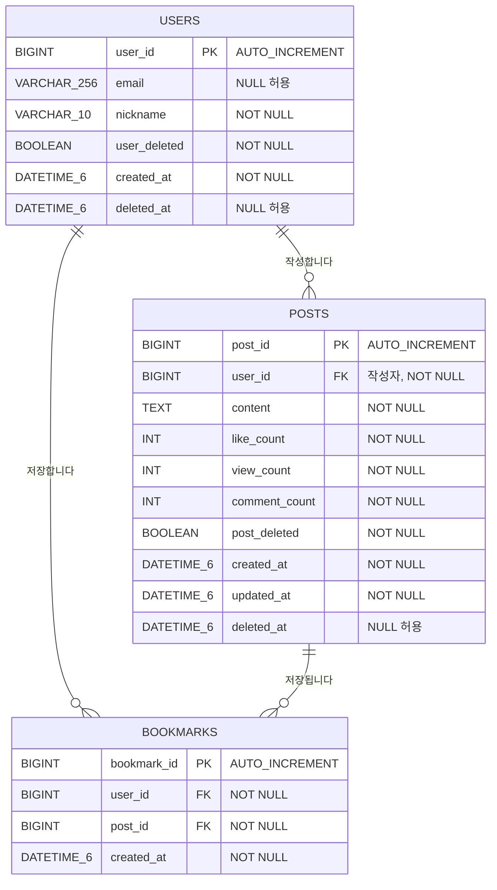

# 북마크 ERD

- 작성일: 2026-08-05
- 대상 기능: 사용자별 게시글 북마크 저장·삭제·목록 조회
- 운영 Database: MySQL 8
- 기준 코드: JPA Entity와 Flyway Migration

## 1. 관계 구조입니다



한 사용자는 여러 게시글을 북마크할 수 있고, 한 게시글도 여러 사용자에게
북마크될 수 있습니다. `bookmarks`는 이 다대다 관계를 풀어낸 연결 Entity이며
북마크한 시각을 함께 저장합니다.

각 `bookmarks` 행은 반드시 사용자 한 명과 게시글 한 개를 참조합니다. 반대로
사용자나 게시글은 북마크가 하나도 없을 수 있습니다.

이 ERD는 북마크 기능에 초점을 맞춘 도메인 관점입니다. `users`와 `posts`는
관계와 조회 조건에 필요한 주요 Column만 표시하며 전체 Schema Column은
Migration 파일을 기준으로 합니다.

## 2. 테이블 정의입니다

### 2.1 `bookmarks` 테이블입니다

| Column        | MySQL Type    | Null | Key        | 설명                                 |
| ------------- | ------------- | ---- | ---------- | ------------------------------------ |
| `bookmark_id` | `BIGINT`      | 불가 | PK         | 북마크 식별자이며 자동 증가합니다.   |
| `user_id`     | `BIGINT`      | 불가 | FK         | 북마크를 저장한 사용자를 참조합니다. |
| `post_id`     | `BIGINT`      | 불가 | FK         | 북마크한 게시글을 참조합니다.        |
| `created_at`  | `DATETIME(6)` | 불가 | Index 포함 | 북마크 생성 시각입니다.              |

운영 MySQL의 실제 DDL은 다음과 같습니다.

```sql
CREATE TABLE bookmarks (
    bookmark_id BIGINT NOT NULL AUTO_INCREMENT,
    user_id BIGINT NOT NULL,
    post_id BIGINT NOT NULL,
    created_at DATETIME(6) NOT NULL,
    PRIMARY KEY (bookmark_id),
    CONSTRAINT uk_bookmarks_user_post UNIQUE (user_id, post_id),
    CONSTRAINT fk_bookmarks_user
        FOREIGN KEY (user_id) REFERENCES users (user_id),
    CONSTRAINT fk_bookmarks_post
        FOREIGN KEY (post_id) REFERENCES posts (post_id),
    INDEX idx_bookmarks_user_created_at (
        user_id,
        created_at DESC,
        bookmark_id DESC
    )
) ENGINE=InnoDB
  DEFAULT CHARSET=utf8mb4
  COLLATE=utf8mb4_0900_ai_ci;
```

## 3. Constraint와 Index입니다

### 3.1 중복 북마크를 Database에서도 차단합니다

```text
uk_bookmarks_user_post (user_id, post_id)
```

같은 사용자가 같은 게시글을 두 번 저장할 수 없도록 복합 Unique Constraint를
적용합니다. Application Service도 저장 전에 존재 여부를 확인하지만, 최종
데이터 무결성은 Database Constraint가 보장합니다.

### 3.2 사용자별 최신 북마크 조회를 지원합니다

```text
idx_bookmarks_user_created_at (
    user_id,
    created_at DESC,
    bookmark_id DESC
)
```

목록 조회는 사용자 ID로 범위를 좁히고 최신 북마크부터 정렬합니다. 생성 시각이
같을 때는 `bookmark_id DESC`를 두 번째 정렬 기준으로 사용해 순서를
결정적으로 만듭니다.

Repository의 실제 조회 규칙은 다음 Method 이름에 포함되어 있습니다.

```java
Slice<Bookmark>
findAllByUserAndPost_PostDeletedFalseOrderByCreatedAtDescBookmarkIdDesc(
    User user,
    Pageable pageable
);
```

### 3.3 Foreign Key에는 Cascade Delete를 사용하지 않습니다

| Constraint          | 참조 관계                           | 삭제 동작                    |
| ------------------- | ----------------------------------- | ---------------------------- |
| `fk_bookmarks_user` | `bookmarks.user_id → users.user_id` | 명시적인 Cascade가 없습니다. |
| `fk_bookmarks_post` | `bookmarks.post_id → posts.post_id` | 명시적인 Cascade가 없습니다. |

사용자와 게시글은 물리 삭제보다 `user_deleted`, `post_deleted`를 사용하는 Soft
Delete 구조입니다. 게시글이 Soft Delete되어도 기존 북마크 행은 남아 있을 수
있지만 북마크 목록 조회에서는 `post_deleted=false`인 게시글만 반환합니다.

삭제되거나 존재하지 않는 게시글은 새로 북마크할 수 없습니다. 북마크 삭제
API도 먼저 활성 게시글을 확인하므로 게시글이 Soft Delete된 뒤에는
`POST_NOT_FOUND`를 반환합니다.

## 4. JPA Mapping입니다

```java
@Entity
@Table(
    name = "bookmarks",
    uniqueConstraints = @UniqueConstraint(
        name = "uk_bookmarks_user_post",
        columnNames = {"user_id", "post_id"}
    )
)
public class Bookmark {

    @Id
    @GeneratedValue(strategy = GenerationType.IDENTITY)
    @Column(name = "bookmark_id")
    private Long bookmarkId;

    @ManyToOne(fetch = FetchType.LAZY, optional = false)
    @JoinColumn(name = "user_id", nullable = false)
    private User user;

    @ManyToOne(fetch = FetchType.LAZY, optional = false)
    @JoinColumn(name = "post_id", nullable = false)
    private Post post;

    @Column(name = "created_at", nullable = false, updatable = false)
    private LocalDateTime createdAt;
}
```

`User`와 `Post`는 모두 LAZY Loading으로 연결합니다. 북마크 목록에서는 Post와
작성자 정보를 함께 사용하므로 Repository에 다음 EntityGraph를 적용해 필요한
관계를 한 번에 조회합니다.

```java
@EntityGraph(attributePaths = {"post", "post.authorUser"})
Slice<Bookmark>
findAllByUserAndPost_PostDeletedFalseOrderByCreatedAtDescBookmarkIdDesc(
    User user,
    Pageable pageable
);
```

## 5. 데이터 생성·조회·삭제 규칙입니다

| 동작               | 규칙                                                                           |
| ------------------ | ------------------------------------------------------------------------------ |
| 생성               | 활성 사용자와 활성 게시글이 모두 존재해야 합니다.                              |
| 중복 생성          | 새 행을 만들지 않고 기존 북마크 상태를 성공으로 반환합니다.                    |
| 사용자 격리        | `(user_id, post_id)` 기준이므로 다른 사용자의 북마크에는 영향을 주지 않습니다. |
| 목록 조회          | 로그인 사용자 소유이며 `post_deleted=false`인 북마크만 조회합니다.             |
| 정렬               | `created_at DESC`, `bookmark_id DESC` 고정 정렬입니다.                         |
| 삭제               | 행이 있으면 삭제하고, 없어도 성공으로 처리합니다.                              |
| 게시글 Soft Delete | 북마크 행은 유지될 수 있지만 목록에서는 제외합니다.                            |

## 6. Migration 파일입니다

- MySQL 운영 Schema:
  [`V1__create_initial_schema.sql`](../src/main/resources/db/migration/mysql/V1__create_initial_schema.sql)
- H2 테스트 Schema:
  [`V4__create_bookmarks.sql`](../src/main/resources/db/migration/h2/V4__create_bookmarks.sql)
- JPA Entity:
  [`Bookmark.java`](../src/main/java/com/ian/community/post/domain/Bookmark.java)
- Repository:
  [`BookmarkRepository.java`](../src/main/java/com/ian/community/post/repository/BookmarkRepository.java)

MySQL과 H2 모두 `(user_id, post_id)` Unique Constraint와 사용자별 최신순 조회
Index를 동일하게 구성합니다. Flyway 통합 테스트에서도 북마크 테이블과 Unique
Constraint 생성을 확인합니다.
